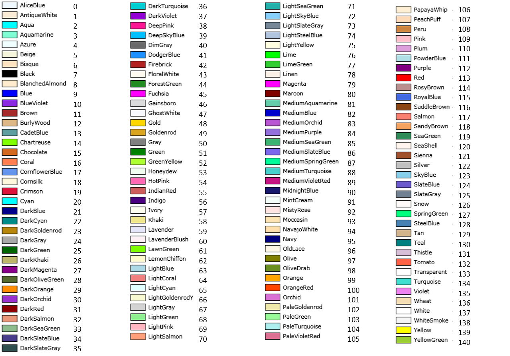

# ET\_EmulationColors

## Overview

|  |  |
| --- | --- |
| Type: | Enumeration |
| Available as of: | V1.0.0.0 |

## Description

The enumeration ET\_EmulationColors contains the colors supported by EcoStruxure Machine Expert Twin. This representation is based on the X11 color names.

## Enumeration Elements

The graphic displays a sample of the color, the X11 color name and the UDINT value:

Additional enumeration element:

None = 1000

EIO0000004735.06