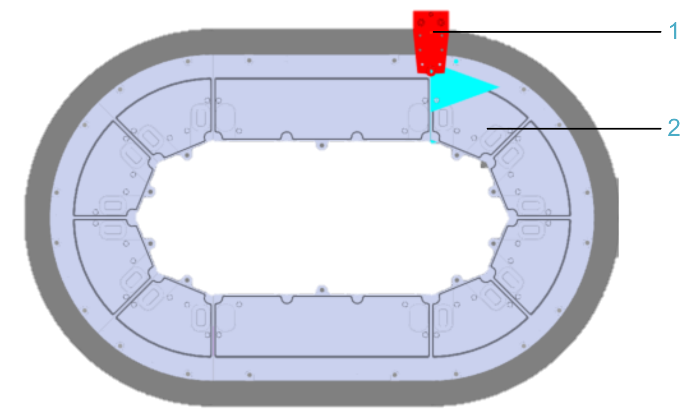
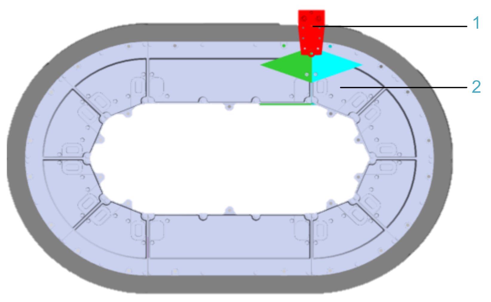

# ST\_TrackConfig

## Overview

|  |  |
| --- | --- |
| Type: | Structure |
| Available as of: | V1.0.0.0 |
| Inherits from: | - |

## Description

The structure ST\_TrackConfig contains parameters to define a track in EcoStruxure Machine Expert Twin.

## Structure Elements

| Name | Data type | Description |
| --- | --- | --- |
| sCategory | STRING[80] | The predefined string which identifies the 3-D model to use in EcoStruxure Machine Expert Twin.  Example:  `'LXMMC12'` |
| sName | STRING[80] | A unique string which identifies the name of the track. This name is used to generate the emulation object.  Example:  `'MC_Track_1'` |
| udiColor | UDINT | The color of the track selected with [ET\_EmulationColors](ET_EmulationColors-66CA3B7A.html).  Example:  ET\_EmulationColors.Gray |
| stPosition | SE\_MATH.ST\_Vector3D | The 3-D vector that provides the position of the origin of the first segment (first element of the string sGeometry) in space (in a cartesian coordinate system).  NOTE: In EcoStruxure Machine Expert, the position values are based on a right-hand coordinate system.  The position is not taken into account in the [Emulation tab of the Multicarrier Configuration editor](../../../../../api/crossBook?lang=en-US&virtualBookName=MLSConfG&topicID=TPC_MLS_Config_Tab_Visualization_DA963F21) .  Example:  G\_stDefaultTrackPosition(2) |
| stOrientation | SE\_MATH.ST\_Vector3D | The 3-D vector that provides the rotation of each axis of the first segment (first element of the string sGeometry) in space (in a cartesian coordinate system).  NOTE: In EcoStruxure Machine Expert, the orientation values use the orientation convention ZYX, based on a right-hand coordinate system.  The orientation is not taken into account in the [Emulation tab of the Multicarrier Configuration editor](../../../../../api/crossBook?lang=en-US&virtualBookName=MLSConfG&topicID=TPC_MLS_Config_Tab_Visualization_DA963F21) .  Example:  G\_stDefaultVector3D(1) |
| udiTrackId | UDINT | The unique track ID. The carriers and the stations use this track ID to identify the track on which they are located.  Example:  `1` |
| xDirection | BOOL | If xDirection is set to TRUE, the working direction in the track is clockwise for closed tracks and from left to right for open tracks, starting with the first segment (first element of the string sGeometry).  If xDirection is set to FALSE, the working direction in the track is counterclockwise or from right to left. In the emulation, this is indicated by the direction of the green arrow.  Also refer to [Examples for the Working Direction and the Logical Start](#ST_TrackConfig-66CFD9CD__Examples-75A3FD2D). |
| lrLogicalStartOffset | LREAL | Reserved |
| sGeometry | STRING (MCR.GPL. Gc\_udiMaxNumberOfSegments) | The geometry of the track.  This string consists of the following characters:   * `S`: long stator motor segment straight of 300 mm * `C`: long stator motor segment arc 45° of 200 mm   The geometry of the track is built in clockwise direction.  Example:  `'CCCCSCCCCS'` |
| udiUnivocalId | UDINT | The concept of a unique identification number (ID) assigns a unique identifier to each relevant entity and target. It is used for the interaction between entities and targets. |
| axSegmentError | ARRAY[1..MCR.GPL.Gc\_udiMaxNumberOfSegments] OF BOOL | Indicates errors detected in the segments. Each element of the array represents the corresponding segment in clockwise direction. The array elements are read in real-time in the emulation if the option multi carrier Error Display is selected in the Auto-Generation menu of EcoStruxure Machine Expert Twin. |
| **(1)** G\_stDefaultVector3D: SE\_MATH.ST\_Vector3D := (lrX := 0, lrY:= 0, lrZ:= 0);  **(2)** G\_stDefaultTrackPosition: SE\_MATH.ST\_Vector3D := (lrX := 0, lrY:= 0, lrZ:= 1000); | | |

## Examples for the Working Direction and the Logical Start

The working direction within a track in the emulation is defined with the parameter xDirection. For general information on the working direction in a multi carrier transport system, refer to the [Multicarrier Library Guide](../../../../../api/crossBook?lang=en-US&virtualBookName=MLSLib&topicID=IntroMC_CoordSys_0FC9FA31).

The following general settings apply for both examples:

* The red carrier (**1**) is at lrPositionX = 0.0.
* The 45° arc segment (**2**) is the first segment of each track `'CCCCSCCCCS'`.

**Example 1**: xDirection = TRUE

The working direction in the track is clockwise for closed tracks and from left to right for open tracks.

**Example 2**: xDirection = FALSE

The working direction in the track is counterclockwise for closed tracks and from right to left for open tracks. In the emulation, this is indicated by the direction of the green arrow pointing to the left.

EIO0000004735.06