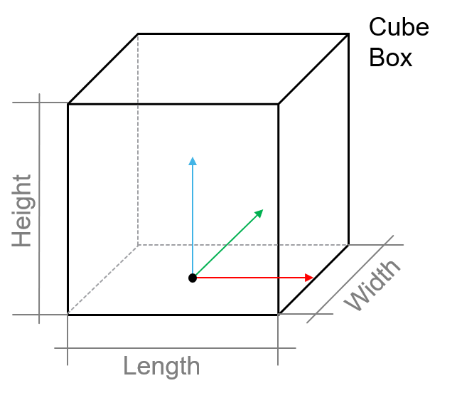

# ST\_GeometricSize

## Overview

|  |  |
| --- | --- |
| Type: | Structure |
| Available as of: | V1.1.0.0 |
| Inherits from: | – |

## Description

The structure ST\_GeometricSize contains the parameters to define the size of a target.

In accordance with the target shape selected in [ET\_GeometricShape](ET_GeomShape-21B66940.html#ET_GeomShape-21B66940), you can use the parameters defined below.

For the Cube shape and the Box shape, you can describe the outer dimensions with the parameters lrLength, lrWidth and lrHeight. The wall thickness of a box is set to 0.3 mm.

## Structure Elements

| Name | Data type | Description |
| --- | --- | --- |
| lrLength | LREAL | The length of a target in X direction. |
| lrWidth | LREAL | The width of a target in Y direction. |
| lrHeight | LREAL | The height of a target in Z direction. |

EIO0000004735.06