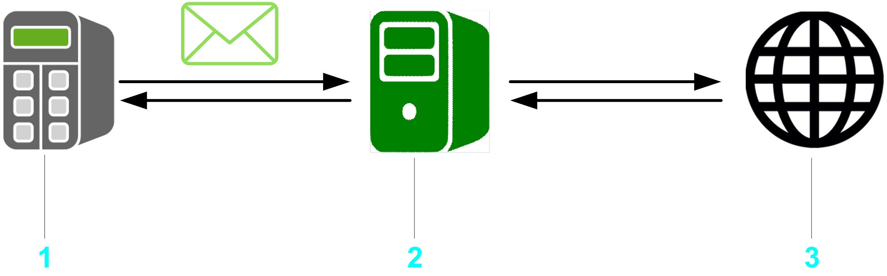

# General Information

## Library Overview

The EmailHandling library provides email client functions that allow your controller to send emails to one or several recipients with the possibility to customize the content. The protocol type used is SMTP as standard for email traffic. It is also possible to receive or delete emails from a server using the Post Office Protocol 3 (POP3).

This library supports SMTP and POP3 via a secured connection using TLS.

Whether a connection using TLS is supported depends on the controller where the FB\_TcpClient2 is used. Refer to the specific manual of your controller to verify if TCP communication using TLS is supported.

You can connect your controller to an email server to send emails about your machine status or report on key performance indicators.

**1** Controller

**2** Email server

**3** Recipients/Sender

## Characteristics of the Library

The following table indicates the characteristics of the library:

| Characteristic | Value |
| --- | --- |
| Library title | EmailHandling |
| Company | Schneider Electric |
| Category | Communication |
| Component | Internet Protocol Suite |
| Default namespace | SE\_EMail |
| Language model attribute | [Qualified-access-only](../../../../../api/crossBook?lang=en-US&virtualBookName=SoLibref&topicID=D_SE_0081219) |
| Forward compatible library | Yes (FCL) |

NOTE: For this library, qualified-access-only is set. This means, that the POUs, data structures, enumerations, and constants have to be accessed using the namespace of the library. The default namespace of the library is SE\_EMail.

## Example Project

In conjunction with the library, the example project EMailHandlingExample.project is provided. The example project shows how to implement the components from the EmailHandling library.

NOTE: The following instructions pertain to EcoStruxure Machine Expert ≤V2.3. In EcoStruxure Machine Expert V2.5, use the EcoStruxure Machine Expert Portal (Platform) to open a new project. For more information, refer to the [Home Page chapter of the EcoStruxure Machine Expert Portal (Platform) User Guide](../../../../../api/crossBook?lang=en-US&virtualBookName=esmepug&topicID=LaunchingPortalHomePageAndAutomatio_01C65C3B).

The example project is installed on your PC along with the programming software. To open the project example, proceed as follows:

| Step | Action | Result |
| --- | --- | --- |
| 1 | In EcoStruxure Machine Expert ≤V2.3, run the command File > New Project. | – |
| 2 | In the New Project dialog box, select the option From Example from the Project type list. | – |
| 3 | On the right-hand side of the New Project dialog box, click Toggle Filter. | Available examples are listed in the drop down menu. |
| 4 | Select your example from the drop-down menu. | – |
| 5 | Select your controller from the Controllers list. | – |
| 6 | Enter a name for the project, and select the file location. | – |
| 7 | Click OK. | A project is created based on the selected example. |

## General Considerations

Consider the following limitations for email transfer:

* Only ASCII symbols are supported.
* Only IPv4 IP addresses are supported.
* The EmailHandling incorporates pointers on addresses.
* Receive acknowledgement is not supported.
* Sending or receiving files via email leads to reset of file attributes.
* In case the address of a recipient does not exist, according to the configuration of the server, either a feedback mail is created or the FB\_SendEMail generates a diagnostic message.
* Archiving emails (sent and received items) has to be performed in the application program.

Executing the Online Change command can change the contents of addresses.

| CAUTION | |
| --- | --- |
|  | INVALID POINTER  Verify the validity of the pointers when using pointers on addresses and executing the Online Change command.  Failure to follow these instructions can result in injury or equipment damage. |

The library described in this document internally uses the TcpUdpCommunication library.

The TcpUdpCommunication (Schneider Electric) and the CAA Net Base Services library (CAA Technical Workgroup) use the same system resources on the controller. The simultaneous use of both libraries in the same application may lead to disturbances during the operation of the controller.

| WARNING | |
| --- | --- |
|  | UNINTENDED EQUIPMENT OPERATION  Do not use the library TcpUdpCommunication (Schneider Electric) and the CAA Net Base Services (CAA Technical Workgroup) library at the same time.  Failure to follow these instructions can result in death, serious injury, or equipment damage. |

NOTE: Schneider Electric adheres to industry best practices in the development and implementation of control systems. This includes a "Defense-in-Depth" approach to secure an Industrial Control System. This approach places the controllers behind one or more firewalls to restrict access to authorized personnel and protocols only.

| WARNING | |
| --- | --- |
|  | UNAUTHENTICATED ACCESS AND SUBSEQUENT UNAUTHORIZED MACHINE OPERATION  * Evaluate whether your application environments are connected to your critical infrastructure and, if so, take appropriate steps in terms of prevention, based on Defense-in-Depth, before connecting the automation system to any network. * Limit the number of devices connected to a network to the minimum necessary. * Isolate your industrial network from other networks inside your company. * Protect any network against unintended access by using firewalls, VPN, or other, proven security measures such as an Intrusion Prevention System or Intrusion Detection System. * Monitor activities within your systems. * Prevent subject devices from direct access or direct link by unauthorized parties or unauthenticated actions. * Install certificates that are issued by publicly known Trusted Certificate Authorities. * Keep your systems up to date and rely only on legitimate sources. * Prepare a recovery plan including backup of your system and process information.  Failure to follow these instructions can result in death, serious injury, or equipment damage. |

For more information on organizational measures and rules covering access to infrastructures, refer to ISO/IEC 27000 series, Common Criteria for Information Technology Security Evaluation, ISO/IEC 15408, IEC 62351, ISA/IEC 62443, NIST Cybersecurity Framework, Information Security Forum - Standard of Good Practice for Information Security and refer to [Cybersecurity Guidelines for EcoStruxure Machine Expert, Modicon and PacDrive Controllers and Associated Equipment](https://www.se.com/ww/en/download/document/EIO0000004242/).

By configuring an allowlist with the input i\_pbyWhiteListSender, the entries of this list are compared to the sender email specified in the header of the received email.

EIO0000002761.03