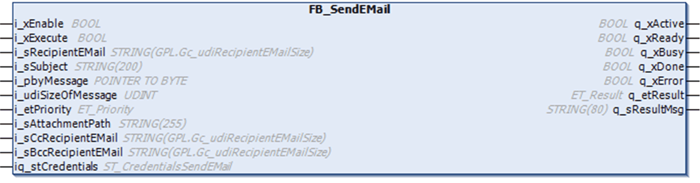

# FB\_SendEMail

## Overview

|  |  |
| --- | --- |
| Type: | Function block |
| Available as of: | V1.0.0.0 |

## Task

The FB\_SendEMail function block includes the related functions for sending emails. Each instance handles one SMTP connection.

## Functional Description

The FB\_SendEMail function block is the user-interface to interact with an external email server. It allows you to send emails.

After the function block has been enabled and is being executed, a TCP connection to the email server is established using the user credentials that have been submitted using iq\_stCredentials. As soon as the connection has been established, email data is transferred to the server. When the data transfer is completed, the TCP connection to the email server is automatically closed by the function block.

When executing the function block, the input i\_pbyMessage is stored internally for further use. In case an online change event is detected while the function block is executed (q\_xBusy = TRUE), the internally used variables are updated with the present value of the input.

NOTE: Do not reassign the i\_pbyMessage to a different memory area while the function block is executed.

## Interface

| Input | Data type | Description |
| --- | --- | --- |
| i\_xEnable | BOOL | Activation and initialization of the function block. |
| i\_xExecute | BOOL | The function block sends an email upon rising edge of this input. |
| i\_sRecipientEMail | STRING [GPL.Gc\_udiRecipientEMailSize] | The string containing the recipient email address(es).(1) |
| i\_sSubject | STRING[200] | Subject of the email. |
| i\_pbyMessage | POINTER TO BYTE | Start address of the string in which the message is stored. |
| i\_udiSizeOfMessage | UDINT | Size of message data. |
| i\_etPriority | ET\_Priority | The [enumeration indicating the priority level that is assigned to the email](D-SE-0080652.html#D-SE-0080652). |
| i\_sAttachmentPath | STRING[255] | Absolute or relative path to the attachment located on the controller file system.  If this string is empty, no attachment is sent. |
| i\_sCcRecipientEMail | STRING [GPL.Gc\_udiRecipientEMailSize] | The string containing the recipient email address(es) assigned to the CC field.(1) |
| i\_sBccRecipientEMail | STRING [GPL.Gc\_udiRecipientEMailSize] | The string containing the recipient email address(es) assigned to the BCC field.(1) |
| **(1)** If more than one recipient, the email addresses must be separated by a semicolon. The maximum size of a single address is restricted to 200 bytes. | | |

| Input / Output | Data type | Description |
| --- | --- | --- |
| iq\_stCredentials | ST\_CredentialsSendEMail | Used to pass the structure containing user settings, such as user name or password. |

| Output | Data type | Description |
| --- | --- | --- |
| q\_xActive | BOOL | If the function block is active, this output is set to TRUE. |
| q\_xReady | BOOL | If the initialization is successful, this output signals a TRUE as long as the function block is capable of accepting inputs. |
| q\_xBusy | BOOL | If this output is set to TRUE, the function block execution is in progress. |
| q\_xDone | BOOL | If this output is set to TRUE, the execution has been completed successfully. |
| q\_xError | BOOL | If this output is set to TRUE, an error has been detected. For details, refer to q\_etResult and q\_etResultMsg. |
| q\_etResult | ET\_Result | [Provides diagnostic and status information](D-SE-0080654.html). |
| q\_sResultMsg | STRING[80] | Provides additional diagnostic and status information. |

## Usage of Variables of Type `POINTER TO ... or REFERENCE TO ...`

The function block provides inputs and/or in/outputs of type POINTER TO… or REFERENCE TO…. With the use of such a pointer or reference, the function block accesses the addressed memory area. In case of an online change event, it may happen that memory areas are moved to new addresses and in consequence a pointer or reference becomes invalid. To help prevent errors associated with invalid pointers, variables of type POINTER TO… or REFERENCE TO… must be updated cyclically or at least at the beginning of the cycle in which they are used.

| CAUTION | |
| --- | --- |
|  | INVALID POINTER  Verify the validity of the pointers when using pointers on addresses and executing the Online Change command.  Failure to follow these instructions can result in injury or equipment damage. |

EIO0000002761.03