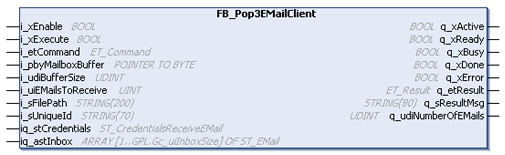

# FB\_Pop3EMailClient

## Overview

|  |  |
| --- | --- |
| Type: | Function block |
| Available as of: | V1.1.2.0 |

## Task

The FB\_Pop3EMailClient function block includes the related functions for receiving and deleting emails using POP3. Each instance handles one POP3 connection.

## Functional Description

The FB\_Pop3EMailClient function block is the user-interface to interact with an external POP3 (email) server. It allows you to receive and delete emails. By using attachments of received emails you are able to get input for several system features which are based on files located on the system memory. Certain file extensions are not allowed to be stored on the controller file system via FB\_Pop3EMailClient (refer to the ET\_EmailStatus.InvalidAttachmentExtension [parameter](D-SE-0080651.html#D-SE-0080651__D-SE-0080651.8)). This applies to files that are handled automatically by the controller and to system files, such as the controller firmware to help prevent unintended overwriting.

| CAUTION | |
| --- | --- |
|  | INVALID POINTER  Verify the validity of the pointers when using pointers on addresses and executing the Online Change command.  Failure to follow these instructions can result in injury or equipment damage. |

After the function block has been enabled and is being executed, a TCP connection to the POP3 server is established using the user credentials that have been submitted using iq\_stCredentials. As soon as the connection has been established, the command specified with i\_etCommand is executed.

When executing the function block, the pointers at i\_pbyMessage and iq\_stCredentials.i\_pbyWhiteListSender are stored internally for further use. In case an online change event is detected while the function block is executed (q\_xBusy = TRUE), the internally used variables are updated with the present value of the pointers.

NOTE: Do not reassign the i\_pbyMessage and iq\_stCredentials.i\_pbyWhiteListSender to a different memory area while the function block is executed.

When the data transfer is completed, the TCP connection to the POP3 server is closed by the function block. Received emails are deleted from the POP3 server.

The function block FB\_Pop3EMailClient saves the information of received emails in the memory area addressed by the pointer i\_pbyMailboxBuffer. The positions inside the buffer, which contain the respective information of the emails, is indicated by the pointers inside the structure iq\_astInbox. In case the function block FB\_Pop3EMailClient is enabled and an online change event is detected, the function block recognizes a possible change of the pointer at i\_pbyMailboxBuffer and the pointers provided within the structure iq\_astInbox are updated accordingly.

NOTE: Process the information from the received emails before modifying the address of the pointer i\_pbyMailboxBuffer for the next execution.

You can manually delete emails by specifying the email with the unique ID at the input  i\_sUniqueId and executing the delete command with i\_etCommand. By executing further commands, the inbox structure available at q\_astInbox containing the references to the email data are reset.

Received emails are held in volatile memory. The volatile memory is cleared when power is removed, and the held emails are therefore deleted.

| NOTICE | |
| --- | --- |
|  | LOSS OF DATA  Save incoming emails to non-volatile memory.  Failure to follow these instructions can result in equipment damage. |

## Interface

| Input | Data type | Description |
| --- | --- | --- |
| i\_xEnable | BOOL | Activation and initialization of the function block. |
| i\_xExecute | BOOL | The function block receives or deletes an email upon rising edge of this input. |
| i\_etCommand | ET\_Command | The [enumeration indicating the command to be executed](D-SE-0080650.html#D-SE-0080650). |
| i\_pbyMailboxBuffer | POINTER TO BYTE | Start address of the first byte in which the incoming emails are stored. |
| i\_udiBufferSize | UDINT | Size of the mailbox buffer. |
| i\_uiEMailsToReceive | UINT | Number of emails to receive from the server. |
| i\_sFilePath | STRING[200] | Path to the folder in the controller file system where the folder EMailAttachments is created. Inside this folder, the attachments of the received emails are stored. The files with an extension defined in the ET\_EMailStatus.InvalidAttachmentExtension [parameter](D-SE-0080651.html#D-SE-0080651__D-SE-0080651.8) cannot be stored.  NOTE: If you receive a second attachment with identical name as an already available attachment in this folder, the previous file is overwritten if the global parameter `ST_CredentialsReceiveEMail.i_xOverwriteAttachment` is set to TRUE.  If this string is empty, the folder EMailAttachments is created at the default file path of the controller. |
| i\_sUniqueID | STRING[70] | The unique ID that is required to delete an email. After the email has been received from the server, the unique ID is displayed at the output q\_astInbox. |

| Input / Output | Data type | Description |
| --- | --- | --- |
| iq\_stCredentials | ST\_CredentialsReceiveEMail | Used to pass the structure containing user settings, such as user name or password. |
| iq\_astInbox | ARRAY [1…GPL.Gc\_udiInboxSize] OF ST\_EMail | [Structure](D-SE-0080658.html#D-SE-0080658) which contains the information of received emails. |

| Output | Data type | Description |
| --- | --- | --- |
| q\_xActive | BOOL | If the function block is active, this output is set to TRUE. |
| q\_xReady | BOOL | If the initialization is successful, this output signals a TRUE as long as the function block is operational. |
| q\_xBusy | BOOL | If this output is set to TRUE, the function block execution is in progress. |
| q\_xDone | BOOL | If this output is set to TRUE, the execution has been completed successfully. |
| q\_xError | BOOL | If this output is set to TRUE, an error has been detected. For details, refer to q\_etResult and q\_etResultMsg. |
| q\_etResult | ET\_Result | [Provides diagnostic and status information](D-SE-0080654.html). |
| q\_sResultMsg | STRING[80] | Provides additional diagnostic and status information. |
| q\_udiNumberOfEmails | UDINT | Depends on the executed i\_etCommand:   * ET\_Command.CheckInbox: Indicates the number of emails available on the server. * ET\_Command.Receive: Indicates the number of emails received from the server.  If an error has been detected, this output provides the number of emails downloaded successfully. * ET\_Command.Delete: Indicates the number of emails deleted. |

## Usage of Variables of Type `POINTER TO ...` or `REFERENCE TO ...`

The function block provides inputs and/or in/outputs of type POINTER TO… or REFERENCE TO…. With the use of such a pointer or reference, the function block accesses the addressed memory area. In case of an online change event, it may happen that memory areas are moved to new addresses and in consequence a pointer or reference becomes invalid. To help prevent errors associated with invalid pointers, variables of type POINTER TO… or REFERENCE TO… must be updated cyclically or at least at the beginning of the cycle in which they are used.

| CAUTION | |
| --- | --- |
|  | INVALID POINTER  Verify the validity of the pointers when using pointers on addresses and executing the Online Change command.  Failure to follow these instructions can result in injury or equipment damage. |

EIO0000002761.03