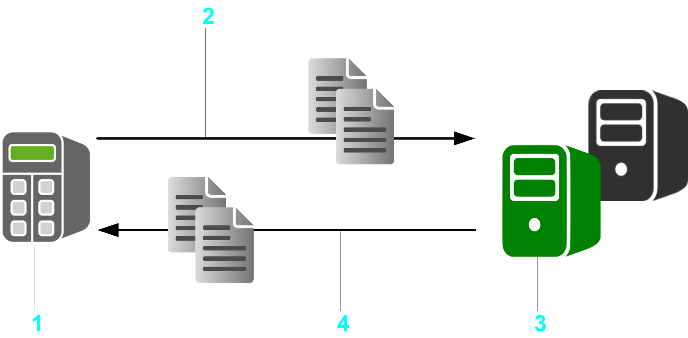

# General Information

## Library Overview

The FtpRemoteFileHandling library provides the following FTP client functionalities for remote file handling:

* Reading files
* Writing files
* Deleting files
* Listing content of remote directories
* Adding directories
* Removing directories

**1** Controller as FTP client

**2** Upload file (Store command)

**3** FTP server (on PC or controller)

**4** Download file (Retrieve command)

## Characteristics of the Library

The following table indicates the characteristics of the library:

| Characteristic | Value |
| --- | --- |
| Library title | FtpRemoteFileHandling |
| Company | Schneider Electric |
| Category | Communication |
| Component | Internet protocol suite |
| Default namespace | SE\_FTP |
| Language model attribute | [Qualified-access-only](../../../../../api/crossBook?lang=en-US&virtualBookName=SoLibref&topicID=D_SE_0081219) |
| Forward compatible library | Yes ([FCL](../../../../../api/crossBook?lang=en-US&virtualBookName=SoLibref&topicID=D_SE_0081226)) |

NOTE: For this library, qualified-access-only is set. This means that the POUs, data structures, enumerations, and constants have to be accessed using the namespace of the library. The default namespace of the library is SE\_FTP.

## General Considerations

Consider the following limitations for FTP data transfer:

* Only ASCII symbols are supported for file and directory names to be exchanged with the FTP server.
* Only IPv4 (Internet Protocol version 4) is supported.
* Only passive mode FTP is supported.
* Only one FTP connection is allowed at a time.
* Only the UNIX directory listing style is supported for listing the content of a selected remote directory. Other listing styles of the external FTP servers can lead to an incomplete representation.
* Since the response time of the FTP server cannot be controlled, execute the function blocks in a low-priority, cyclic task. Adapt the watchdog function for this task to allow sufficient time for the connection. Alternatively, execute the function blocks in a Freewheeling task. For this type of task, no cycle time is defined.

The library described in this document internally uses the TcpUdpCommunication library.

The TcpUdpCommunication (Schneider Electric) and the CAA Net Base Services library (CAA Technical Workgroup) use the same system resources on the controller. The simultaneous use of both libraries in the same application may lead to disturbances during the operation of the controller.

| WARNING | |
| --- | --- |
|  | UNINTENDED EQUIPMENT OPERATION  Do not use the library TcpUdpCommunication (Schneider Electric) and the CAA Net Base Services (CAA Technical Workgroup) library at the same time.  Failure to follow these instructions can result in death, serious injury, or equipment damage. |

## Considerations Concerning Cyber Security

The FtpRemoteFileHandling library functions provides different functions blocks for secured and unsecured connections:

* The FB\_FtpSecureClient supports secured connections using TLS (Transport Layer Security).
* The FB\_FtpClient does not support secured connections. Therefore, communication must only be performed inside your industrial network, isolated from other networks inside your company, and protected from the Internet.

NOTE: Schneider Electric adheres to industry best practices in the development and implementation of control systems. This includes a "Defense-in-Depth" approach to secure an Industrial Control System. This approach places the controllers behind one or more firewalls to restrict access to authorized personnel and protocols only.

| WARNING | |
| --- | --- |
|  | UNAUTHENTICATED ACCESS AND SUBSEQUENT UNAUTHORIZED MACHINE OPERATION  * Evaluate whether your application environments are connected to your critical infrastructure and, if so, take appropriate steps in terms of prevention, based on Defense-in-Depth, before connecting the automation system to any network. * Limit the number of devices connected to a network to the minimum necessary. * Isolate your industrial network from other networks inside your company. * Protect any network against unintended access by using firewalls, VPN, or other, proven security measures such as an Intrusion Prevention System or Intrusion Detection System. * Monitor activities within your systems. * Prevent subject devices from direct access or direct link by unauthorized parties or unauthenticated actions. * Install certificates that are issued by publicly known Trusted Certificate Authorities. * Keep your systems up to date and rely only on legitimate sources. * Prepare a recovery plan including backup of your system and process information.  Failure to follow these instructions can result in death, serious injury, or equipment damage. |

For more information on organizational measures and rules covering access to infrastructures, refer to ISO/IEC 27000 series, Common Criteria for Information Technology Security Evaluation, ISO/IEC 15408, IEC 62351, ISA/IEC 62443, NIST Cybersecurity Framework, Information Security Forum - Standard of Good Practice for Information Security and refer to [Cybersecurity Guidelines for EcoStruxure Machine Expert, Modicon and PacDrive Controllers and Associated Equipment](https://www.se.com/ww/en/download/document/EIO0000004242/).

EIO0000002779.05