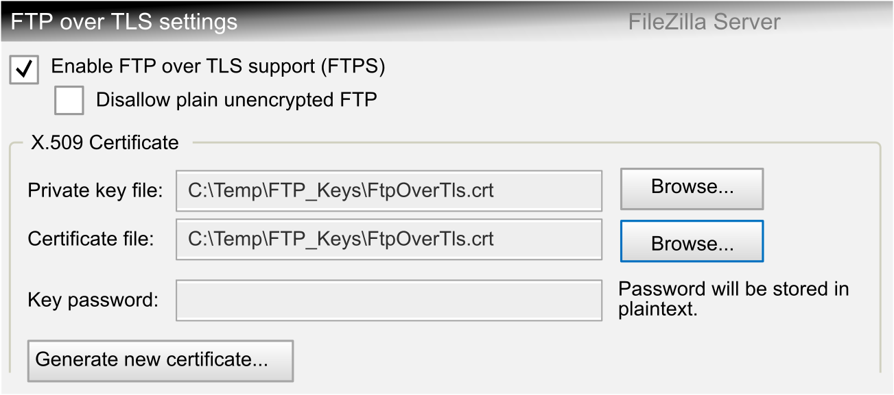
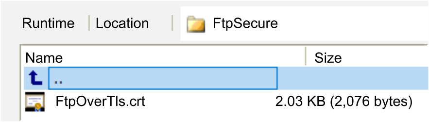

# ST\_SecureCredentials

## Overview

|  |  |
| --- | --- |
| Type: | Structure |
| Available as of: | V1.4.3.0 |
| Inherits from: | – |

## Description

The structure ST\_SecureCredentials contains the user-specific information for establishing a secured connection via TLS to an external FTP server.

NOTE: Commands to handle a login are not included in the enumeration ET\_FtpCommand. The user credentials are used to establish a secured connection via TLS to the specified host automatically after the function block has been enabled. Port 21 is the default, monitored port for the FTP server. In order to modify these credentials, disable the function and re-enable it with the new information.

## Certificate (Key) File Management

The structure ST\_SecureCredentials allows you to configure the client certificate. The client certificate can optionally be used in secured FTP connections by the server to verify that this is the correct client to connect to.

For configuring the server certificate which is required to establish a secured FTP connection using TLS, refer to the [Programming Guide of your controller](../../../../../api/crossBook?lang=en-US&virtualBookName=m262prg&topicID=FTPServerCertificateVerification_1E1CDE8B).

* Controller certificate

  To use the default certificate of the controller, the inputs sCertFileName and sKeyFileName must contain a null string.

  This default controller certificate is displayed in the Security Screen editor of the EcoStruxure Machine Expert Logic Builder: In the Own Certificates folder of the Devices tab when your controller is selected. For further information, refer to the [How To Manage Certificates on the Controller User Guide](../../../../../api/crossBook?lang=en-US&virtualBookName=HowMgCer&topicID=D_SE_0096333_8).
* Customer-specific certificate

  To use your own certificate, you must store the following external file(s) on the controller file system.

  + Either two individual files: One file containing the certificate that must be assigned to the input sCertFileName and another file containing the key information that must be assigned to the input sKeyFileName.
  + Or one file that contains both, certificate and key information. In this case, assign the same file to both inputs sCertFileName and sKeyFileName.

Your individual file(s) must be available in standard Base64 PEM format. These files can be generated using freeware tools such as Open SSL or FileZilla Server.

The following example illustrates the FileZilla Server option to generate a PEM file:

Only one self-generated \*.crt file containing the certificate and the key information that was generated with FileZilla Server and stored on the file system of a Modicon M262 Logic/Motion Controller is displayed in the next figure.

## Structure Elements

| Name | Data type | Description |
| --- | --- | --- |
| i\_sServerIp | STRING [15] | The IP address of the external FTP server. |
| i\_sUsername | STRING [255] | The username to access the external FTP server. |
| i\_sPassword | STRING [255] | The password to access the external FTP server. |
| sCertFileName | STRING [255] | Specifies the optional external certificate file of the FTP client. |
| sKeyFileName | STRING [255] | Specifies the optional external client key file of the FTP client. |

## Used By

* FB\_FtpSecureClient

EIO0000002779.05