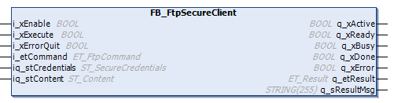

# FB\_FtpSecureClient

## Overview

|  |  |
| --- | --- |
| Type: | Function block |
| Available as of: | V1.4.3.0 |

## Task

The FB\_FtpSecureClient function block is dedicated to secured FTP (FTP over TLS) connections. It includes the related FTP functionalities for operations on files and directories. Each instance handles one secured FTP connection. In case you attempt to establish a second transfer, the function block responds with ET\_Result.UnableToEstablishMutlipleConnections.

## Functional Description

The FB\_FtpSecureClient function block is the user-interface to interact with the external FTP server via a secured connection over TLS. As a prerequisite for secured communication, the connection to the FTP server must be declared as trusted. For further information, refer to the [Programming Guide of your controller](../../../../../api/crossBook?lang=en-US&virtualBookName=m262prg&topicID=FTPServerCertificateVerification_1E1CDE8B).

After the function block has been enabled, a secured FTP connection is established using the secured user credentials that are submitted using iq\_stCredentials. As soon as the secured connection has been established, the function block is capable of processing commands submitted by i\_etCommand and a rising edge detected at i\_xExecute.

As long as commands are executed, the output q\_xBusy is set to TRUE. After a command has been successfully completed, q\_xDone is set to TRUE.

Status messages and diagnostic information are provided using the outputs q\_xError (TRUE if an error has been detected), q\_etResult and q\_etResultMsg.

If q\_xError indicates TRUE, an error has been detected during execution. Another execution of the function block is not possible as long the error state is present. Certain error messages can be reset using the input i\_xErrorQuit.

If the error state persists upon a rising edge of i\_xErrorQuit, the function block must be disabled in order to reset the error state.

When disabling the function block (i\_xEnable = FALSE), it must be called as long as q\_xActive = TRUE in order to complete the internal cleanup routines. Afterwards it can be re-enabled.

If a timeout is exceeded after the connection has been established, the execution of the next FTP command (ET\_FtpCommand) is detected as an error. To avoid this behavior, enable the function block just before performing the related operations and disable it afterwards.

## Interface

| Input | Data type | Description |
| --- | --- | --- |
| i\_xEnable | BOOL | Activation and initialization of the function block.  Refer to [Behavior of Function Blocks with the Inputs i\_xEnable and i\_xExecute and i\_xErrorQuit](i_xErrorQuit-145B4D67.html). |
| i\_xExecute | BOOL | The command specified with the input i\_etCommand is executed upon rising edge of this input.  Refer to [Behavior of Function Blocks with the Inputs i\_xEnable and i\_xExecute and i\_xErrorQuit](i_xErrorQuit-145B4D67.html). |
| i\_xErrorQuit | BOOL | Certain diagnostic messages (for example, incorrect command or command with incorrect arguments) can be reset upon a rising edge of this input.  Refer to [Behavior of Function Blocks with the Inputs i\_xEnable and i\_xExecute and i\_xErrorQuit](i_xErrorQuit-145B4D67.html). |
| i\_etCommand | ET\_FtpCommand | The FTP command that is executed if the input i\_xExecute is TRUE. |

| Input/Output | Data type | Description |
| --- | --- | --- |
| iq\_stCredentials | ST\_SecureCredentials | Used to pass the structure containing secured user settings, such as user name or password. |
| iq\_stContent | ST\_Content | Used to pass the working directory and, if applicable, the amount and names of files in this directory. |

| Output | Data type | Description |
| --- | --- | --- |
| q\_xActive | BOOL | If the function block is active, the output is set to TRUE. |
| q\_xReady | BOOL | If the initialization is successful, the output is set to TRUE as long as the function block is capable of accepting inputs. |
| q\_xBusy | BOOL | If this output is set to TRUE, the function block executes the command specified at i\_etCommand. |
| q\_xDone | BOOL | If this output is set to TRUE, the function block has successfully completed the command specified at i\_etCommand. |
| q\_xError | BOOL | If this output is set to TRUE, an error has been detected. For details, refer to q\_etResult and q\_etResultMsg. |
| q\_etResult | ET\_Result | Provides diagnostic and status information. |
| q\_sResultMsg | STRING[255] | Provides additional diagnostic and status information. |

EIO0000002779.05