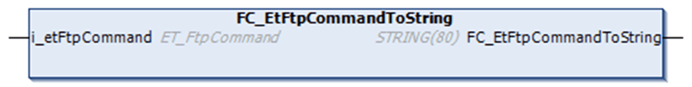

# FC\_EtFtpCommandToString

## Overview

|  |  |
| --- | --- |
| Type: | Function |
| Available as of: | V1.0.1.0 |
| Inherits from: | – |
| Implements: | – |

## Task

Convert an enumeration element of type ET\_FtpCommand to a string value containing the FTP command.

## Functional Description

Using the function FC\_EtFtpCommandToString, you can convert an enumeration element of type ET\_FtpCommand to a string value.

## Interface

| Input | Data type | Description |
| --- | --- | --- |
| i\_etFtpCommand | ET\_FtpCommand | Enumeration element to be converted. |

## Return Value

| Data type | Description |
| --- | --- |
| STRING(80) | The ET\_FtpCommand converted to a string value.  If i\_etFtpCommand is indeterminable, the return value is:  `Unknown Result: <Value of the input i_etFtpResult>`. |

EIO0000002779.05