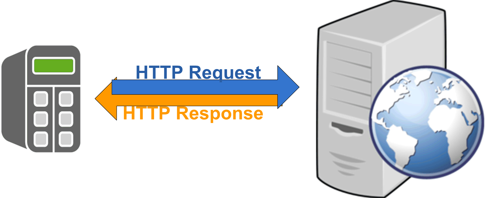

# General Information

## Library Overview

With the HttpHandling library, you can implement the HTTP client functionality in your controller application. The library supports the HTTP version 1.1.

The HTTP (Hypertext Transfer Protocol) function is a request-response protocol in the client/server computing model. For the connection between a client and a server, the TCP (Transport Layer Protocol) is used. The client submits an HTTP request message to the server. The server returns a response message to the client. The response contains status information about the request and may also contain requested content in its message text.

This library supports HTTP via a secured connection using TLS (Transport Layer Security), also known as HTTPS. Whether a connection using TLS is supported depends on the controller where the FB\_HttpClient is used. Refer to the specific manual of your controller to verify if TCP communication using TLS is supported.

With V1.3.1.0 and later versions of this library, the OAuth (Open Authorization) protocol version 2.0 is supported which allows access to protected resources after authorization of the client at the authorization server.

## Characteristics of the Library

The following table indicates the characteristics of the library:

| Characteristic | Value |
| --- | --- |
| Library title | HttpHandling |
| Company | Schneider Electric |
| Category | Communication |
| Component | Internet Protocol Suite |
| Default namespace | SE\_HTTP |
| Language model attribute | [Qualified-access-only](../../../../../api/crossBook?lang=en-US&virtualBookName=SoLibref&topicID=D_SE_0081219) |
| Forward compatible library | Yes (FCL) |

NOTE: For this library, qualified-access-only is set. Therefore, the POUs, data structures, enumerations, and constants have to be accessed using the namespace of the library. The default namespace of the library is SE\_HTTP.

## Function Template

In EcoStruxure Machine Expert, the function template **HttpClient** is provided as part in the function template library Communication Functions. This function template supports you on implementing an HTTP client in your application.

For more information about this function template and the general use of function templates, refer to the [*Function Template Library Guide*](../../../../../api/crossBook?lang=en-US&virtualBookName=DevTempl&topicID=D_SE_0079263).

## General Considerations

Only IPv4 IP addresses are supported for the communication functions provided with this library.

The library described in this document internally uses the TcpUdpCommunication library.

The TcpUdpCommunication (Schneider Electric) and the CAA Net Base Services library (CAA Technical Workgroup) use the same system resources on the controller. The simultaneous use of both libraries in the same application may lead to disturbances during the operation of the controller.

| WARNING | |
| --- | --- |
|  | UNINTENDED EQUIPMENT OPERATION  Do not use the library TcpUdpCommunication (Schneider Electric) together with the library CAA Net Base Services (CAA Technical Workgroup) simultaneously in the same application.  Failure to follow these instructions can result in death, serious injury, or equipment damage. |

NOTE: Schneider Electric adheres to industry best practices in the development and implementation of control systems. This includes a "Defense-in-Depth" approach to secure an Industrial Control System. This approach places the controllers behind one or more firewalls to restrict access to authorized personnel and protocols only.

| WARNING | |
| --- | --- |
|  | UNAUTHENTICATED ACCESS AND SUBSEQUENT UNAUTHORIZED MACHINE OPERATION  * Evaluate whether your environment or your machines are connected to your critical infrastructure and, if so, take appropriate steps in terms of prevention, based on Defense-in-Depth, before connecting the automation system to any network. * Limit the number of devices connected to a network to the minimum necessary. * Isolate your industrial network from other networks inside your company. * Protect any network against unintended access by using firewalls, VPN, or other, proven security measures. * Monitor activities within your systems. * Prevent subject devices from direct access or direct link by unauthorized parties or unauthenticated actions. * Prepare a recovery plan including backup of your system and process information.  Failure to follow these instructions can result in death, serious injury, or equipment damage. |

For more information on organizational measures and rules covering access to infrastructures, refer to ISO/IEC 27000 series, Common Criteria for Information Technology Security Evaluation, ISO/IEC 15408, IEC 62351, ISA/IEC 62443, NIST Cybersecurity Framework, Information Security Forum - Standard of Good Practice for Information Security and refer to [Cybersecurity Guidelines for EcoStruxure Machine Expert, Modicon and PacDrive Controllers and Associated Equipment](https://www.se.com/ww/en/download/document/EIO0000004242/).

EIO0000003849.02

© 2022

Schneider Electric.

All rights reserved.