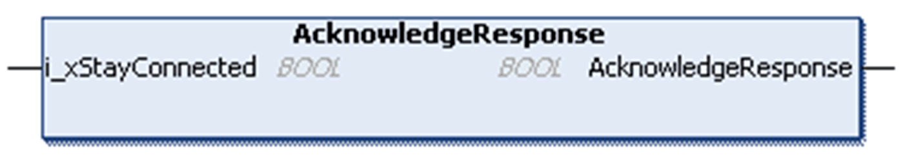

# AcknowledgeResponse - Method

## Overview

|  |  |
| --- | --- |
| Type: | Method |
| Available as of: | V1.0.0.0 |

## Functional Description

By calling the method AcknowledgeResponse, you acknowledge that the response received by the HTTP server has been processed in your application and is not required anymore.

A call of the method AcknowledgeResponse is allowed only in state ResponseAvailable.

With the input i\_xStayConnected, you can specify whether the connection to the server is to be maintained or not. This allows you to send further requests immediately. Consider that most HTTP servers will interrupt the connections of inactive clients after a certain time.

## State Transition of the Client

| Stage | Description |
| --- | --- |
| 1 | Initial state: ResponseAvailable |
| 2 | Function call |
| 3 | Depending on input i\_xStayConnected:   * If TRUE: state = Connected * If FALSE: state = Disconnecting -> Final state: Idle, otherwise an error is detected |

NOTE: For HTTP 1.1, connections are persistent by default allowing to use a single TCP connection to send multiple HTTP requests. Most HTTP servers implement a short connection timeout.

NOTE: For HTTP 1.0, the additional header Connection: keep-alive must be used to establish a persistent TCP connection to the HTTP server.

## Interface

| Input | Data type | Description |
| --- | --- | --- |
| i\_xStayConnected | BOOL | Specifies if the connection to the server is to be maintained. |

EIO0000003849.02

© 2022

Schneider Electric.

All rights reserved.