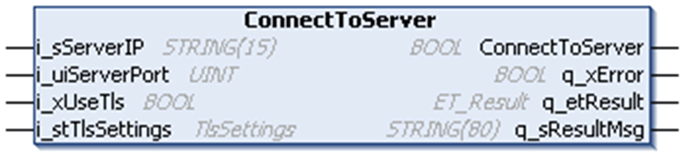

# ConnectToServer - Method

## Overview

|  |  |
| --- | --- |
| Type: | Method |
| Available as of: | V1.0.0.0 |

## Task

The method ConnectToServer initiates the TCP connection to the server.

## Functional Description

This method is used to initiate the establishing of a TCP connection to the server, which is specified by its IPv4 address and the corresponding port. The standard ports for HTTP are 80 and 443 (secured, HTTPS). Set the parameter i\_xUseTls to TRUE to specify that a secured connection is to be established.

The return value of the method indicates only whether the connection could be initiated successfully. The status of the connection must be verified using the property State. Evaluate the diagnostic outputs of the method, in case the return value is FALSE. An error indicated by these outputs needs no reset.

## Considerations for the Use with an HTTP Proxy

If there is an HTTP proxy between your controller and the remote HTTP server, you must specify the connection parameters of the proxy in the ConnectToServer method. If the client is connected to the proxy, the HTTP traffic is forwarded between the client and the remote server through the proxy server. The address and the port will be obtained from the proxy server out of the header of the sent HTTP request. They correspond to the parameter i\_sHost of the corresponding method for sending an HTTP request.

NOTE: Refer to the [Example Code](D-SE-0095573.html#D-SE-0095573__D-SE-0095573.2) for more details.

If a proxy server prohibits the forwarding of HTTP traffic between your client and the HTTP server but supports establishing a tunnel to the remote server, you can implement the connection to the remote server by using the method ConnectToServerByProxy.

## Considerations for Secured Connections Using TLS

TLS is used to encrypt the communication between client and server. In addition to the encryption, TLS provides the possibility to verify the identity of the communication partner using certificates.

Certificates are exchanged during the establishing of a connection: the TLS handshake. The sending of certificates during TLS handshake is optional, but the communication partner may require the certificate. If the result of the verification of the certificate is positive, a connection with the communication partner can be established. If the execution of the ConnectToServer method with xUseTls = TRUE ends up in state Error with ErrorResult = ConnectFailed, it might be that there is a certificate issue.

If this is the case, verify the TLS configuration for the server and the client.

| If... | Then ... |
| --- | --- |
| If the server is configured to verify the client certificate. | Ensure that the parameter i\_stTlsSettings.xSendClientCertificate is set to TRUE. |
| If the client is configured to verify the server certificate, i\_stTlsSettings.etCertVerifyMode is different than NotVerified. | Ensure that the server sends its certificate. |
| If the client is configured to accept only trusted certificates, i\_stTlsSettings.etCertVerifyMode = TrustedOnly. | Ensure that the server certificate is rated as trusted.  To do so, manage the certificates on your controller manually. This can be done using the editor Security Screen in Machine Expert Logic Builder. |

For more information about certificate management on the controller, refer to [How to Manage Certificates on the Controller in EcoStruxure Machine Expert - User Guide](../../../../../api/crossBook?lang=en-US&virtualBookName=HowMgCer&topicID=D_SE_0095876).

## State Transition of the Client

| Stage | Description |
| --- | --- |
| 1 | Initial state: Idle |
| 2 | Function call |
| 3 | State: Connecting, otherwise an error is detected |
| 4 | Final state: Connected, otherwise an error is detected |

## Interface

| Input | Data type | Description |
| --- | --- | --- |
| i\_sServerIP | STRING[15] | Specifies the IP address of the server to connect to. |
| i\_uiServerPort | UINT | Specifies the port address of the server. |
| i\_xUseTls | BOOL | Set to TRUE to specify the use of a secured connection using TLS. |
| i\_stTlsSettings | TlsSettings | Specifies the TLS settings for the secured connection. |

| Output | Data type | Description |
| --- | --- | --- |
| q\_xError | BOOL | If this output is set to TRUE, an error has been detected. For details, refer to q\_etResult and q\_etResultMsg. |
| q\_etResult | [ET\_Result](D-SE-0095555.html#D-SE-0095555__D-SE-0095555.4) | Provides diagnostic and status information as a numeric value. |
| q\_sResultMsg | STRING[80] | Provides additional diagnostic and status information as a text message. |

EIO0000003849.02

© 2022

Schneider Electric.

All rights reserved.