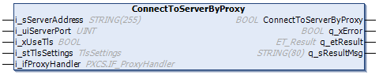

# ConnectToServerByProxy - Method

## Overview

|  |  |
| --- | --- |
| Type: | Method |
| Available as of: | V1.3.1.0 |

## Task

The method ConnectToServerByProxy initiates the TCP connection to the HTTP server through a proxy server.

## Functional Description

This method is used to initiate the establishing of a TCP connection to the HTTP server through a proxy server. For the connection request to the proxy server, a function block implementing the interface IF\_ProxyHandler must be implemented in your application. This function block must be assigned to the input i\_ifProxyHandler.

Once a valid interface has been assigned to the input, the interface methods are called from the function block while establishing a connection to the HTTP server.

The call sequence is as follows:

1. When the method ConnectToServerByProxy is executed, the interface method ConnectToProxy is called.

   If TLS encryption is selected for the connection to the HTTP server, the socket type StartTls is set to TRUE. The method is called cyclically until one of the outputs q\_xDone (connection established) or q\_xError (unsuccessful connection) indicates TRUE.
2. After the connection to the proxy server has been established, the interface method ConnectToRemoteServer is called.

   If TLS encryption is selected for the connection to the HTTP server, the option UpgradeToTls is set to TRUE. The method is called cyclically until one of the outputs q\_xDone (connection established) or q\_xError (unsuccessful connection) indicates TRUE.
3. After the method ConnectToRemoteServer has been completed successfully, the instance of the FB\_HttpClient is connected to the remote server. The data exchange with the server using the corresponding methods is possible. The interface IF\_ProxyHandler is not required until the next TCP connection is initiated using the method ConnectToServerByProxy.

The return value of the method indicates only whether the connection could be initiated successfully. The status of the connection must be verified using the property State. Evaluate the diagnostic outputs of the method, in case the return value is FALSE. An error indicated by these outputs needs no reset.

If an error is detected during establishing a connection, the interface method Abort of the IF\_ProxyHandler is called once.

For more information about the implementation of the interface methods or about implementations already provided, refer to the [ProxyCommunicationSupport Library Guide](../../../../../api/crossBook?lang=en-US&virtualBookName=PrxComSu&topicID=LibraryGuideProxyCommunicationSuppo_0141DAC0).

## Considerations for Secured Connections Using TLS

Refer to [Considerations for Secured Connections Using TLS](D-SE-0095575.html#D-SE-0095575__D-SE-0095575.11) of the ConnectToServer method.

## State Transition of the Client

| Stage | Description |
| --- | --- |
| 1 | Initial state: Idle |
| 2 | Function call |
| 3 | State: Connecting, otherwise an error is detected |
| 4 | Final state: Connected, otherwise an error is detected |

## Interface

| Input | Data type | Description |
| --- | --- | --- |
| i\_sServerAddress | STRING[255] | Specifies the IP address or host name of the server to connect to. |
| i\_uiServerPort | UINT | Specifies the port address of the server. |
| i\_xUseTls | BOOL | Set to TRUE to specify the use of a secured connection using TLS. |
| i\_stTlsSettings | TlsSettings | Specifies the TLS settings for the secured connection. |
| i\_ifProxyHandler | PXCS.IF\_ProxyHandler | Function block implementing the interface IF\_ProxyHandler providing the methods and properties to implement the additional steps for establishing a connection to an HTTP server through a proxy server. |

| Output | Data type | Description |
| --- | --- | --- |
| q\_xError | BOOL | If this output is set to TRUE, an error has been detected. For details, refer to q\_etResult and q\_etResultMsg. |
| q\_etResult | [ET\_Result](D-SE-0095555.html#D-SE-0095555__D-SE-0095555.4) | Provides diagnostic and status information as a numeric value. |
| q\_sResultMsg | STRING[80] | Provides additional diagnostic and status information as a text message. |

EIO0000003849.02

© 2022

Schneider Electric.

All rights reserved.