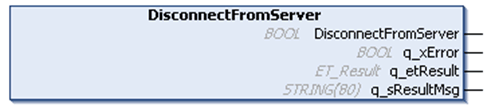

# DisconnectFromServer -Method

## Overview

|  |  |
| --- | --- |
| Type: | Method |
| Available as of: | V1.0.0.0 |

## Functional Description

The method DisconnectFromServer initiates the disconnection from the HTTP server.

The return value of the method indicates only whether the disconnection could be initiated successfully. The progress of the disconnection must be verified using the property State. Evaluate the diagnostic outputs of the method, in case the return value is FALSE. An error indicated by these outputs needs no reset.

## State Transition of the Client

| Stage | Description |
| --- | --- |
| 1 | The method DisconnectFromServer can be called in every state different than Idle. |
| 2 | Function call |
| 3 | State: Disconnecting, otherwise an error is detected |
| 4 | Final state: Idle, otherwise an error is detected |

## Interface

| Output | Data type | Description |
| --- | --- | --- |
| q\_xError | BOOL | If this output is set to TRUE, an error has been detected. For details, refer to q\_etResult and q\_etResultMsg. |
| q\_etResult | [ET\_Result](D-SE-0095555.html#D-SE-0095555__D-SE-0095555.4) | Provides diagnostic and status information as a numeric value. |
| q\_sResultMsg | STRING[80] | Provides additional diagnostic and status information as a text message. |

EIO0000003849.02

© 2022

Schneider Electric.

All rights reserved.