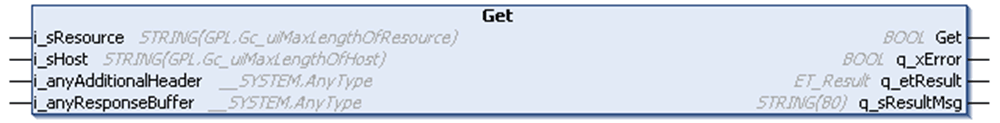

# Get - Method

## Overview

|  |  |
| --- | --- |
| Type: | Method |
| Available as of: | V1.0.0.0 |



## Task

The method Get initiates the HTTP method to request a representation of the specified resource.

## Functional Description

By using the inputs i\_sHost (mandatory) and i\_sResource the default header of the HTTP request is created. If additional information must be added to the header, they must be passed through the input i\_anyAdditionalHeader. Data assigned to this input is not verified. At the input i\_anyResponseBuffer, you must assign a buffer of sufficient size for storing the entire response received from the server.

The return value of the method is of type BOOL and indicates whether the execution of the method was successful (TRUE) or not (FALSE). Evaluate the diagnostic outputs of the method, in case the return value is FALSE. An error indicated by these outputs needs no reset. The property State must be used to obtain the status of processing.

A call of the method Get is allowed only in state Connected.

## Implementation Example

Following example displays how the HTTP request looks like after calling the method Get.

Method call:

```
sAdditionalHeader := 'Content-Type: application/json$r$nConnection: Keep-Alive';

fbHTTP.Get(   i_sRessource:= 'example',
              i_sHost:= 'se.com',
              i_anyAdditionalHeader:= sAdditionalHeader,
              i_anyResponseBuffer:= sResponse);
```

Resulting HTTP request:

```
GET /example HTTP/1.1
Host: se.com
Content-Length: 0
Content-Type: application/json
Connection: Keep-Alive
```

## State Transition of the Client

| Stage | Description |
| --- | --- |
| 1 | Initial state: Connected |
| 2 | Function call |
| 3 | State: SendingRequest, otherwise an error is detected |
| 4 | Final state: ResponseAvailable, otherwise an error is detected |

NOTE: In case of online modifications while the function block is processing a Get request, the execution is aborted to prevent a possible access violation caused by processing erroneous pointer addresses.

## Interface

| Input | Data type | Description |
| --- | --- | --- |
| i\_sResource | STRING[GPL.Gc\_uiMaxLengthOfResource] | Specifies the resource on the host which is to be reached by the request. |
| i\_sHost | STRING[GPL.Gc\_uiMaxHostSize] | Specifies the address of the host, and if required, extended by the port. |
| i\_anyAdditionalHeader | ANY\_STRING | Specifies additional entries to be added to the header of the HTTP request. |
| i\_anyResponseBuffer | ANY | Buffer for storing the response from the server. |

| Output | Data type | Description |
| --- | --- | --- |
| q\_xError | BOOL | If this output is set to TRUE, an error has been detected. For details, refer to q\_etResult and q\_etResultMsg. |
| q\_etResult | ET\_Result | Provides diagnostic and status information as a numeric value. |
| q\_sResultMsg | STRING[80] | Provides additional diagnostic and status information as a text message. |

EIO0000003849.02

© 2022

Schneider Electric.

All rights reserved.