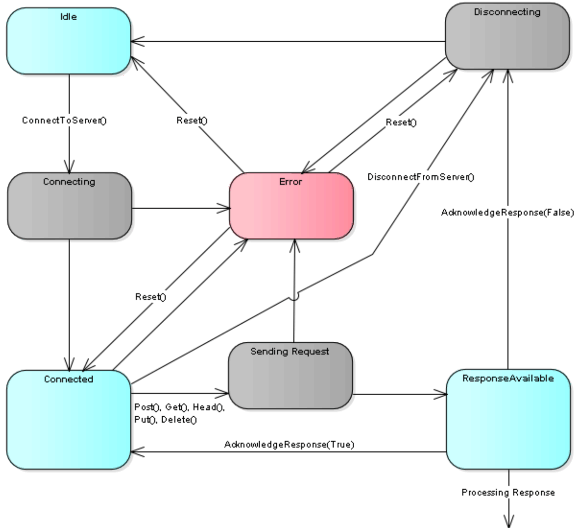

# FB\_HttpClient

## Overview

|  |  |
| --- | --- |
| Type: | Function block |
| Available as of: | V1.0.0.0 |
| Inherits from: | - |
| Implements: | - |

## Task

The function block FB\_HttpClient provides the functionality of an HTTP client.

## Functional Description

The function block does not provide any parameters (inputs and outputs). To control and monitor the HTTP client, the function block provides methods and properties.

Which method or property can be called, depends on the state of the HTTP client. The following diagram illustrates the state machine implemented by the function block FB\_HttpClient. The present state is indicated by the property State:

NOTE: The functionality triggered by sending an HTTP request depends on the server implementation.

NOTE: The content contained in the response can be encoded using the chunked transfer encoding. Verify the property IsContentChunked before processing the content.

EIO0000003849.02

© 2022

Schneider Electric.

All rights reserved.