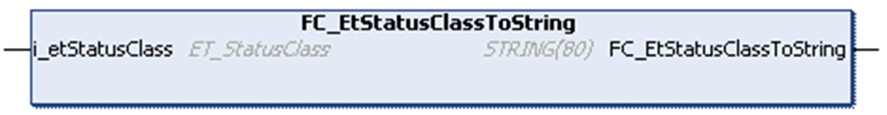

# FC\_ETStatusClassToString

## Overview

|  |  |
| --- | --- |
| Type: | Function |
| Available as of: | V1.0.0.0 |
| Inherits from: | - |
| Implements: | - |

## Task

Convert an enumeration element of type ET\_StatusClass to a variable of type STRING.

## Functional Description

Using the function FC\_ETStatusClassToString, you can convert an enumeration element of type ETStatusClass to a variable of type STRING.

## Interface

| Input | Data type | Description |
| --- | --- | --- |
| i\_etStatusClassToString | ET\_StatusClassToString | Enumeration with the status class. |

## Return Value

| Data type | Description |
| --- | --- |
| STRING(80) | The ET\_StatusClass converted to text. |

EIO0000003849.02

© 2022

Schneider Electric.

All rights reserved.