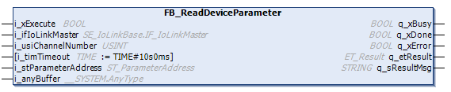

# FB\_ReadDeviceParameter - Functional Description

## Overview

|  |  |
| --- | --- |
| Type: | Function block |
| Available as of: | V1.0.0.0 |

## Functional Description

The function block FB\_ReadDeviceParameter is used to read parameters out of the IO-Link device.

The IO-Link protocol follows the big-endian layout. Depending on the read parameter type, consider a byte swap before processing the data from i\_anyBuffer.

NOTE: If the IO-Link master is connected by Sercos protocol, the Sercos state must be in state 4 and the outputs of the bus coupler enabled to initiate that which is required for the communication to the IO-Link master and devices and to use this function block.

The maximum number of bytes that can be read with one execution are 232 bytes.

Up to 300 simultaneous function block executions for the read and write operations are supported.

NOTE: Do not change i\_anyBuffer while q\_xBusy is TRUE.

NOTE: The same buffer cannot be used for more than one read/write operation at a time. This can result in corrupted or inconsistent data.

| WARNING | |
| --- | --- |
|  | UNINTENDED EQUIPMENT OPERATION  * Do not modify input parameters while the Busy output is equal to TRUE. * Ensure that each function block instance that is executing has its own, unique buffer space.  Failure to follow these instructions can result in death, serious injury, or equipment damage. |

## Interface

| Input | Data type | Range | Description |
| --- | --- | --- | --- |
| i\_xExecute | BOOL | – | On rising edge, process is started. |
| i\_ifIoLinkMaster | SE\_IoLinkMaster.IF\_IoLinkMaster | – | Interface of the IO-Link master.  NOTE: Provide the IoLink master instance of type FB\_IoLinkMaster specified inside the Devices tree. |
| i\_usiChannelNumber | USINT | 1-4 | Channel number of the IO-Link device. |
| i\_timTimeout | TIME | T#1s – T#60s | Maximum time to establish the connection.  Default value: T#10s  In case the timeout is configured lower/higher than allowed by the range, it is automatically set to the minimum/maximum value allowed by the range.  NOTE: Take the fieldbus cycle, the task bus cycle, the bitrate of the IO-Link device (COM 1/2/3), and the minimum cycle time of the IO-Link device into account before setting the timeout. |
| i\_stParameterAddress | [ST\_ParameterAddress](ST_ParameterAddress-0C9661EA.html#ST_ParameterAddress-0C9661EA) | – | Structure containing the parameter address. |
| i\_anyBuffer | ANY | – | Application buffer in which the read data is copied. |

| Output | Data type | Description |
| --- | --- | --- |
| q\_xDone | BOOL | Indicates that the execution process has been completed successfully. |
| q\_xBusy | BOOL | Indicates that the execution process is in progress. |
| q\_xError | BOOL | If this output is set to TRUE, an error has been detected. For details, refer to q\_etResult and q\_etResultMsg. |
| q\_etResult | [ET\_Result](ET_Result-1041B315.html#ET_Result-1041B315) | Provides diagnostic and status information as a numeric value. |
| q\_sResultMsg | STRING [80] | Provides additional diagnostic and status information as a text message. |

EIO0000004573.02