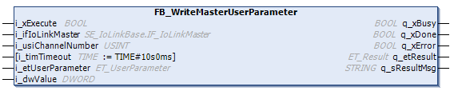

# FB\_WriteMasterUserParameter - Functional Description

## Overview

|  |  |
| --- | --- |
| Type: | Function block |
| Available as of: | V1.0.0.0 |

## Functional Description

The function block FB\_WriteMasterUserParameter is used to write user parameters to the IO-Link master connected. Depending on the user parameter to be written, the corresponding enumeration must be assigned to the generic input i\_dwValue, for example for ET\_UserParameter.OperatingMode the enumeration ET\_OperationMode.

NOTE: If the IO-Link master is connected by Sercos protocol, the Sercos state must be in state 2, 3 or 4 and the outputs of the bus coupler enabled to initiate that which is required for the communication to the IO-Link master and devices and to use this function block.

## Interface

| Input | Data type | Range | Description |
| --- | --- | --- | --- |
| i\_xExecute | BOOL | – | On rising edge, process is started. |
| i\_ifIoLinkMaster | SE\_IoLinkMaster.IF\_IoLinkMaster | – | Interface of the IO-Link master.  NOTE: Provide the IoLink master instance of type FB\_IoLinkMaster specified inside the Devices tree. |
| i\_usiChannelNumber | USINT | 1-4 | Channel number of the IO-Link device. |
| i\_timTimeout | TIME | T#1s – T#60s | Maximum time to establish the connection.  Default value: T#10s  In case the timeout is configured lower/higher than allowed by the range, it is automatically set to the minimum/maximum value allowed by the range.  NOTE: Take the fieldbus cycle and the task bus cycle into account before setting the timeout. |
| i\_etUserParameter | [ET\_UserParameter](ET_UserParameter-106EB52E.html#ET_UserParameter-106EB52E) | – | Structure containing the parameter address. |
| i\_dwValue | DWORD | – | Value to write. |

| Output | Data type | Description |
| --- | --- | --- |
| q\_xDone | BOOL | Indicates that the execution process has been completed successfully. |
| q\_xBusy | BOOL | Indicates that the execution process is in progress. |
| q\_xError | BOOL | If this output is set to TRUE, an error has been detected. For details, refer to q\_etResult and q\_etResultMsg. |
| q\_etResult | [ET\_Result](ET_Result-1041B315.html#ET_Result-1041B315) | Provides diagnostic and status information as a numeric value. |
| q\_sResultMsg | STRING [80] | Provides additional diagnostic and status information as a text message. |

EIO0000004573.02