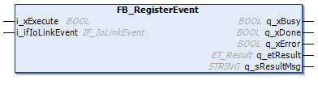
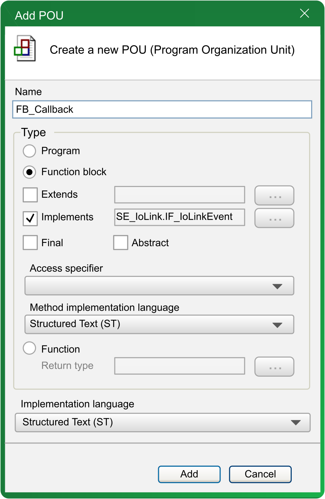
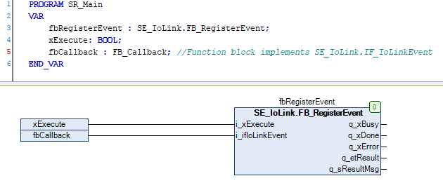
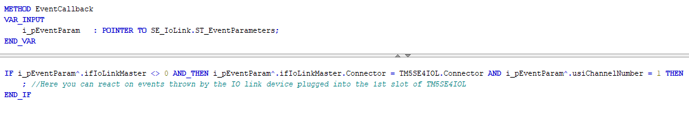

# FB\_RegisterEvent - Functional Description

## Overview

|  |  |
| --- | --- |
| Type: | Function block |
| Available as of: | V1.0.0.0 |

## Functional Description

The function block FB\_RegisterEvent is used to register a callback to the IO-Link events. To update the callback assign the new value to i\_ifIoLinkEvent and execute the function block again. A callback can contain up to 16 events. If more events will occur at the same time, these will be splitted to further callbacks.

NOTE: If the IO-Link master is connected by Sercos protocol, the Sercos state must be in state 4 and the outputs of the bus coupler enabled to initiate that which is required for the communication to the IO-Link master and devices and to use this function block.

## Interface

| Input | Data type | Description |
| --- | --- | --- |
| i\_xExecute | BOOL | On rising edge, process is started. |
| i\_ifIoLinkEvent | IF\_IoLinkEvent | IF\_IoLinkEvent to be called in case an event is generated.  NOTE: Provide the IoLink master instance of type FB\_IoLinkMaster specified inside the Devices tree. |

| Output | Data type | Description |
| --- | --- | --- |
| q\_xDone | BOOL | Indicates that the execution process has been completed successfully. |
| q\_xBusy | BOOL | Indicates that the execution process is in progress. |
| q\_xError | BOOL | If this output is set to TRUE, an error has been detected. For details, refer to q\_etResult and q\_etResultMsg. |
| q\_etResult | [ET\_Result](ET_Result-1041B315.html#ET_Result-1041B315) | Provides diagnostic and status information as a numeric value. |
| q\_sResultMsg | STRING [80] | Provides additional diagnostic and status information as a text message. |

## Example

Following example indicates the registration of the function block instance fbCallback as callback to events generated by the IO-Link master and devices. You have to declare the function block FB\_Callback inside the application and implement the interface SE\_IoLink.IF\_IoLinkEvent.

The instance of this function block can then be passed to the function block instance fbRegisterEvent. By executing the function block instance fbRegisterEvent the callback is registered.

In case a callback is generated, the method fbCallback.EventCallback is called by the system. Following example indicates the implementation of the EventCallback method to react on the generated events by the IO-Link device inserted into the first slot of the IO link master TM5SE4IOL.

EIO0000004573.02