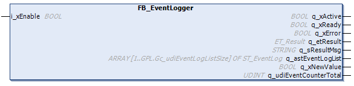

# FB\_EventLogger - Functional Description

## Overview

|  |  |
| --- | --- |
| Type: | Function block |
| Available as of: | V1.2.5.0 |

## Functional Description

The function block FB\_EventLogger is used to log the IO-Link events. By enabling the function block, a callback is registered to the IO-Link events. Based on the first-in-first-out principle, the output q\_astEventLogList lists the newest IO-Link events detected including a time stamp based on the RTC of the controller. The output q\_xNewValue indicates that at least one new event is logged per cycle. The total number of events detected since the function block was enabled is indicated by the output q\_udi\_EventCounterTotal.

NOTE: If the IO-Link master is connected by Sercos protocol, the Sercos state must be in state 4 and the outputs of the bus coupler enabled to initiate that which is required for the communication to the IO-Link master and devices and to use this function block.

## Interface

| Input | Data type | Description |
| --- | --- | --- |
| i\_xEnable | BOOL | The function block starts logging the IO-Link events on a rising edge of this input.  Refer to [Behavior of Function Blocks with the Input i\_xEnable](i_xEnable-145A050A.html). |

| Output | Data type | Description |
| --- | --- | --- |
| q\_xActive | BOOL | Indicates that the execution of the function block is active. As long this output is TRUE, the function block must be executed cyclically. |
| q\_xReady | BOOL | Indicates that the callback to the IO-Link events was registered successfully and that the logging process is running. |
| q\_xError | BOOL | Indicates that an error was detected during the execution of the function block. |
| q\_etResult | [ET\_Result](ET_Result-1041B315.html#ET_Result-1041B315) | Provides diagnostic and status information as a numeric value. |
| q\_sResultMsg | STRING [80] | Provides additional diagnostic and status information as a text message. |
| q\_astEventLogList | ARRAY[1..GPL.Gc\_udiEventLogListSize] OF ST\_EventLog | Array containing the last logged events. |
| q\_xNewValue | BOOL | Indicates that a new value was logged in this cycle. |
| q\_udiEventCounterTotal | UDINT | Indicates the total number of IO-Link events logged since the function block was enabled. |

EIO0000004573.02