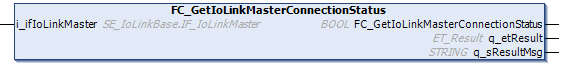

# FC\_GetIoLinkMasterConnectionStatus

## Overview

The function FC\_GetIoLinkMasterConnectionStatus is used to retrieve the connection status of the IO-Link master. If the function returns the value TRUE, the connection between the controller and the IO-Link master specified at the function input is established and is running.

## Interface

| Input | Data type | Description |
| --- | --- | --- |
| i\_ifIoLinkMaster | SE\_IoLinkBase.IF\_IoLinkMaster | Interface of the IoLinkMaster.  NOTE: Provide the IoLink master instance of type FB\_IoLinkMaster specified inside the Devices tree. |

| Output | Data type | Description |
| --- | --- | --- |
| q\_etResult | [ET\_Result](ET_Result-1041B315.html#ET_Result-1041B315) | Provides diagnostic and status information as a numeric value. |
| q\_sResultMsg | STRING [80] | Provides additional diagnostic and status information as a text message. |

## Return Value

| Data type | Description |
| --- | --- |
| BOOL | If the function returns the value TRUE, the connection between the controller and the IO-Link master specified at the function input is established and is running. |

EIO0000004573.02