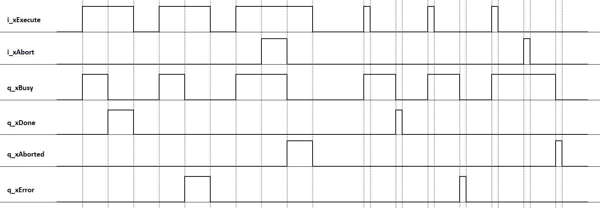

# Behavior of Function Blocks with the Input i\_xExecute and i\_xAbort

## General Information

A rising edge of the input i\_xExecute starts the execution of the function block. The function block continues execution and the output q\_xBusy is set to TRUE. A rising edge at the input i\_xExecute is ignored while the function block is being executed.

A rising edge of the input i\_xAbort aborts the execution of the function block. As soon as the abort procedure has been finished, the output q\_xAborted is set to TRUE.

Once the execution or abort procedure has been finished, the outputs q\_xDone, q\_xError or q\_xAborted remain TRUE until the input i\_xExecute is set to FALSE. If the input is reset before the execution is finished, the outputs q\_xDone, q\_xError or q\_xAborted are set to TRUE for one cycle. One cycle indicates the period until the next call of the function block.

## Example

EIO0000004401.03