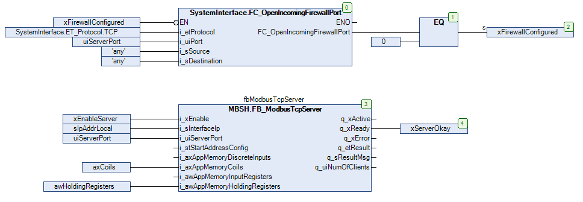

# Example Code

## Overview

The following example code illustrates the implementation of the FB\_ModbusTcpServer function block.

## SR\_ModbusTcpServer

Configuration of the Modbus TCP server:

* Providing access to 16 coils at address 1...16
* Providing access to 10 holding registers at address 1...10

The example is provided for an implementation in an application with a PacDrive LMC controller. Therefore, the POU SR\_ModbusTcpServer implements the function for configuring the firewall in order to allow incoming requests through the specified TCP port (502 in the following example).

NOTE: The function for configuring the firewall used in this example is only supported by PacDrive LMC controllers.

```
PROGRAM SR_ModbusTcpServer
VAR
    xEnableServer: BOOL;
    xServerOkay: BOOL;
    fbModbusTcpServer: MBSH.FB_ModbusTcpServer;
    sIpAddrLocal: STRING(15) := '10.128.154.249';
    uiServerPort: UINT := 502;
    axCoils: ARRAY[1..16] OF BOOL;
    awHoldingRegisters: ARRAY[1..10] OF WORD;
    xFirewallConfigured: BOOL;
END_VAR
```



EIO0000004401.03