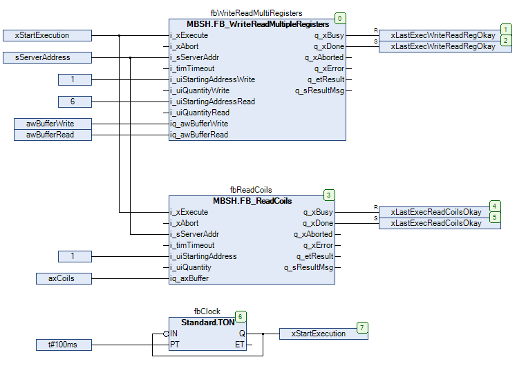

# Modbus TCP Client Example Code

## Overview

The following example code illustrates the implementation of the two client function blocks FB\_ReadCoils and FB\_WriteReadMultipleRegisters.

## SR\_ModbusTcpClient

Configuration for Modbus TCP client functionality:

* The function block FB\_ReadCoils reads 16 coils from address 1...16 of the server.
* The function block FB\_WriteReadMultipleRegisters is used to access the holding registers on the server:
  + Registers at address 1...5 are written.
  + Registers at address 6...10 are read.
* Both client function blocks are executed cyclically with configurable interval.

```
PROGRAM SR_ModbusTcpClient
VAR
    xStartExecution: BOOL;
    sServerAddress: STRING := '10.128.154.249:502';
    fbWriteReadMultiRegisters: MBSH.FB_WriteReadMultipleRegisters;
    fbReadCoils: MBSH.FB_ReadCoils;
    xLastExecWriteReadRegOkay: BOOL;
    xLastExecReadCoilsOkay: BOOL;
    axCoils: ARRAY[1..16] OF BOOL;
    awBufferWrite: ARRAY[1..5] OF WORD;
    awBufferRead: ARRAY[1..5] OF WORD;
    fbClock: Standard.TON;
END_VAR
```



EIO0000004401.03