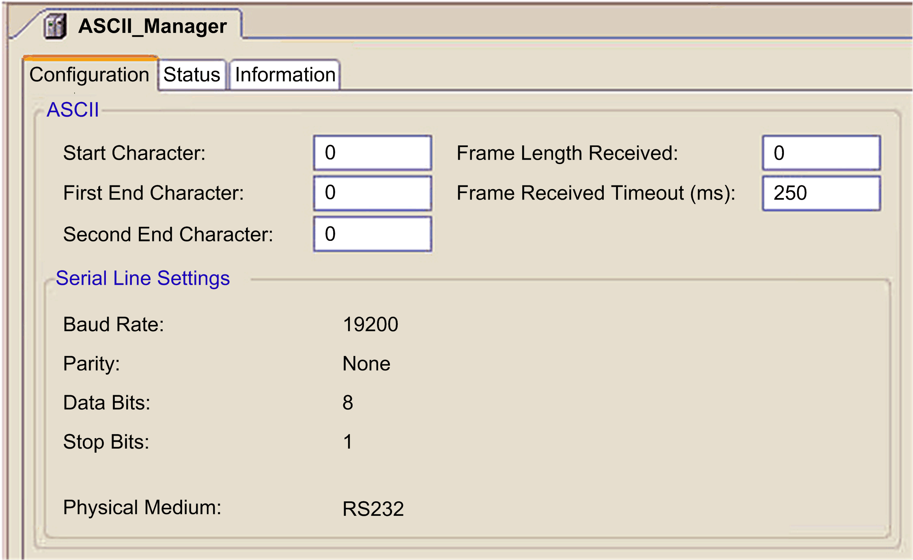

# Adding a Manager to Your Serial Line

Adding a Manager to Your Serial Line

| Step | Action |
| --- | --- |
| 1 | Add the appropriate manager to the serial line. (Refer to your controller's programming manual for details.) |
| 2 | Configure the manager for any required transparent communications. |
| 3 | An ASCII manager is required for SMS functionality. It is recommended that you set an End of Frame detection on Timeout (no End Character and no Frame Length). (Refer to the figure below.) |

