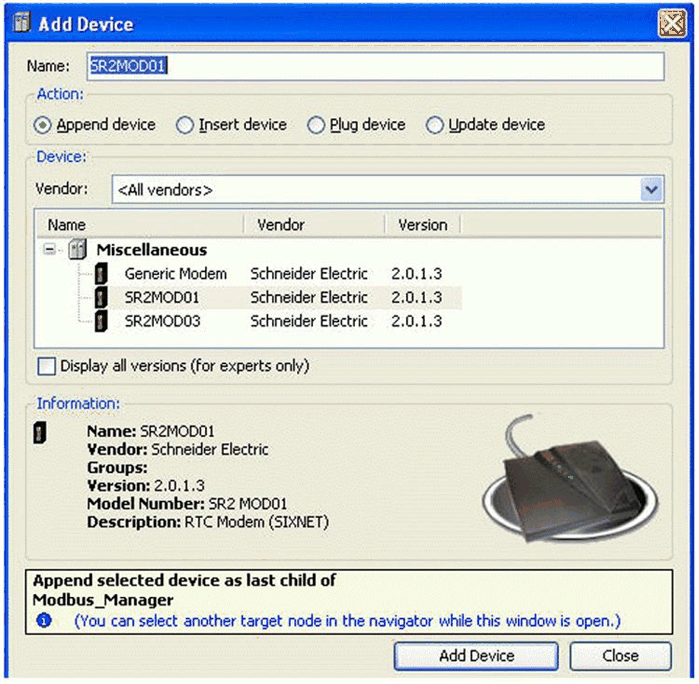
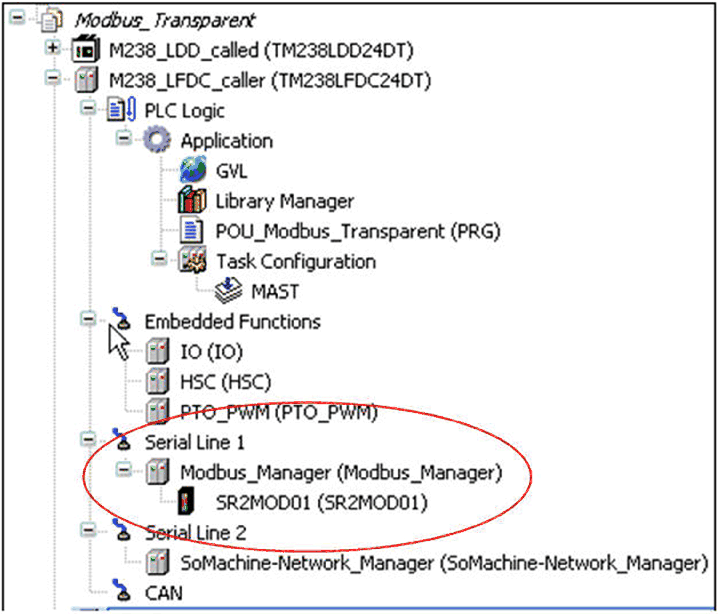

# Adding a Modem to the Manager

Adding a Modem to the Manager

Add the selected modem to the serial line manager configured in the Add Device dialog box:

The modem appears under the serial line manager in the Devices tree:

