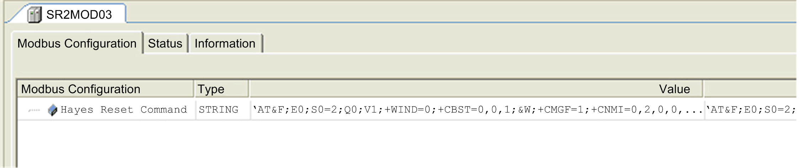

# Modem Editor

Modem Editor

Double-click on the modem to open the device editor:

In the Configuration view, the Hayes Reset Command string is set by default.

For modems SR2MOD01 and TDW33 supported by Schneider Electric, this default command string is set to be used with the following serial line configuration:

Baud rate 19 200

Parity none

Data bits 8

Stop bit 1

If the serial line configuration is different, the command string must be adapted accordingly.

NOTE: The Hayes Reset Command is the modem initialization string that consists of a series of commands which are called Hayes ("AT") commands. This string is sent on the serial line during the application configuration (that is, after the controller's power on, application download, and reset warm or reset cold commands). If the modem answers OK, the connected modem appears with no error (green) in the Devices tree in online mode. Otherwise it appears as a detected error (red triangle).

NOTE: The modem can take several seconds to be ready.