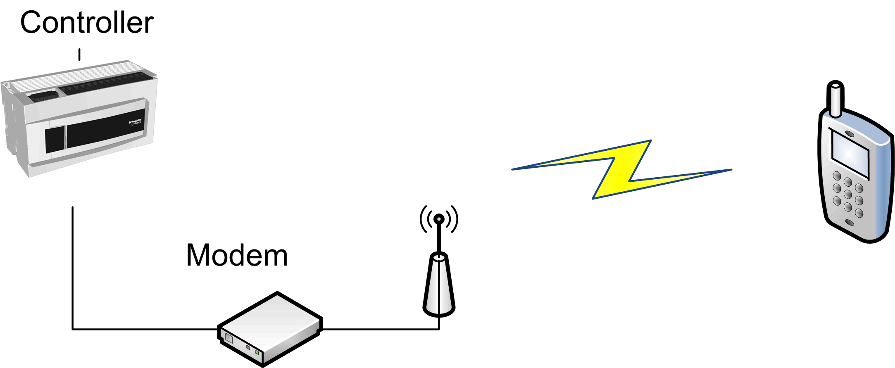

# Introduction

Introduction

The SendSMS function block is used to establish a connection with a GSM modem and send an SMS to a specified receiver. For example, the controller can send [SMS](../glossary/glossary.htm#XREF_D_SE_0024697_386) when a trigger is raised to transmit an alarm to a specified cell phone:

NOTE:

Be sure to have your GSM modem properly configured as follows:

oMake sure the SIM card in the modem is unlocked.

oMake sure the telephone number of the SMS center is valid.

You can use the ConfigSim function block to properly set these parameters from your application program.