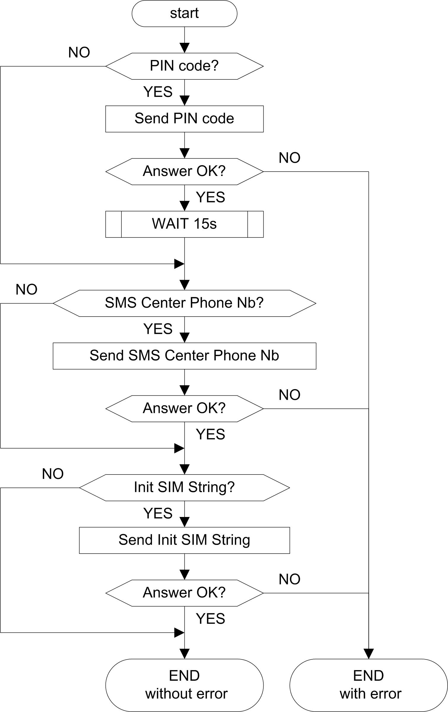

# Introduction

Introduction

Before using any other function block in the MODEM library, use the ConfigSim function block only when your GSM modem’s SIM card requires one of these:

oEnter the PIN code.

oConfigure the SMS center phone number.

oSend an initialization command.

You can then directly use one of the dedicated SMS function blocks.

Different commands are sent to the GSM Modem according to this flowchart:

|  |
| --- |
| Warning_Color.gifWARNING |
| UNINTENDED EQUIPMENT OPERATION |
| If an SR2MOD03 modem with a SIM card protected by a PIN code is used, the default initialization string must be modified in the Modem configuration editor. Replace the value of the Hayes Reset Command with this:  'AT&F;E0;S0=2;Q0;V1;+WIND=0;+CBST=0,0,1;&W'  and use the ConfigSim function block to send an additional initialization command with this:  InitSimString input = 'AT+CMGF=1;+CNMI=0,2,0,0,0;+CSAS'. |
| Failure to follow these instructions can result in death, serious injury, or equipment damage. |