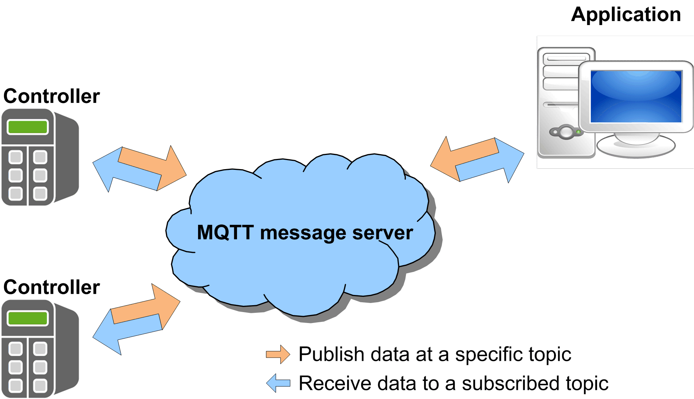

# General Information

## Library Overview

The MqttHandling library implements the Message Queuing Telemetry Transport (MQTT) client functionality in the application program running on a controller. The MQTT provides data exchange between the clients on a publish/subscribe basis. An MQTT client publishes messages (data) on a topic via an MQTT server. The MQTT server, represented by a server, forwards (publishes) the published messages to clients which are subscribed to the respective topic.

This library supports MQTT via a secured connection using TLS (Transport Layer Security).

Whether a connection using TLS is supported depends on the controller where the FB\_TcpClient2 is used. Refer to the specific manual of your controller to verify if TCP communication using TLS is supported.

## Characteristics of the Library

The table indicates the characteristics of the library:

| Characteristic | Value |
| --- | --- |
| Library title | MqttHandling |
| Company | Schneider Electric |
| Category | Communication |
| Component | Internet Protocol Suite |
| Default namespace | SE\_MQTT |
| Language model attribute | [qualified-access-only](../../../../../api/crossBook?lang=en-US&virtualBookName=SoLibref&topicID=D_SE_0081219) |
| Forward compatible library | Yes ([FCL](../../../../../api/crossBook?lang=en-US&virtualBookName=SoLibref&topicID=D_SE_0081226)) |

NOTE: For this library, qualified-access-only is set. This means, that the POUs, data structures, enumerations, and constants have to be accessed using the namespace of the library. The default namespace of the library is SE\_MQTT.

## Controller Platforms

To identify the controllers that are compatible with the library, refer to the [List of Controllers Compatible with your Libraries](../../../../../api/crossBook?lang=en-US&virtualBookName=SoLibOv&topicID=D_SE_0096069).

## Example Project

In conjunction with the library, an example project is provided. The example project demonstrates how to implement the components from the MqttHandling library.

NOTE: The following instructions pertain to EcoStruxure Machine Expert ≤V2.3. In EcoStruxure Machine Expert V2.5, use the EcoStruxure Machine Expert Portal (Platform) to open a new project. For more information, refer to the [Home Page chapter of the EcoStruxure Machine Expert Portal (Platform) User Guide](../../../../../api/crossBook?lang=en-US&virtualBookName=esmepug&topicID=LaunchingPortalHomePageAndAutomatio_01C65C3B).

The example project is installed on your PC along with the programming software. To open the project example, proceed as follows:

| Step | Action | Result |
| --- | --- | --- |
| 1 | In EcoStruxure Machine Expert ≤V2.3, run the command File > New Project. | – |
| 2 | In the New Project dialog box, select the option From Example from the Project type list. | – |
| 3 | On the right-hand side of the New Project dialog box, click Toggle Filter. | Available examples are listed in the drop down menu. |
| 4 | Select your example from the drop-down menu. | – |
| 5 | Select your controller from the Controllers list. | – |
| 6 | Enter a name for the project, and select the file location. | – |
| 7 | Click OK. | A project is created based on the selected example. |

EIO0000002773.04