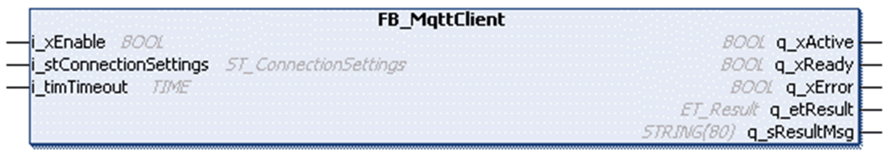

# FB\_MqttClient

## Overview

|  |  |
| --- | --- |
| Type: | Function block |
| Available as of: | V1.0.0.0 |

## Functional Description

The function block FB\_MqttClient is used to establish a connection with the specified MQTT server. The connection is initiated upon a rising edge of the input i\_xEnable. The output q\_xActive indicates that the function block is in progress and must be called cyclically. The status of the connection is indicated by the output q\_xReady. If this output is TRUE, the client is connected.

If the input i\_xEnable is set to FALSE while a connection establishment is in progress, the process is aborted.

If the input i\_xEnable is set to FALSE and a connection exists, the connection is closed as a [clean session](#D-SE-0086575__Session-D9082936). This means that the active subscriptions belonging to this client identifier are cleared on the MQTT server.

After a successfully established connection, the function block manages the messages received from the server in the background. Therefore, the function block must also be called cyclically after the connection has been established.

NOTE: When the MQTT broker sends a message that does not comply with the MQTT protocol, the client disconnects and, with MQTT version 5, the reason code MalformedPacket is sent.

NOTE: When the MQTT broker sends a not supported message that, for example, includes unknown property, the client disconnects and, with MQTT version 5, the reason code ImplementationSpecificError is sent.

## Proxy Configuration

The function block FB\_MqttClient supports establishing a connection to the MQTT server through a proxy server.

If a proxy server prohibits a direct connection between your client and the MQTT server but it supports establishing a tunnel to the remote server, you can implement the connection to the remote server with the help of the interface IF\_ProxyHandler and the corresponding implementation.

The function block FB\_MqttClient provides the property ProxyHandler that allows you to assign an interface of type IF\_ProxyHandler. Once a valid interface has been assigned to the property, the interface methods are called from the function block while establishing a connection to the MQTT server.

The call sequence is as follows:

1. When the function block is enabled, the interface method ConnectToProxy is called.

   If TLS encryption is selected for the connection to the MQTT server, the socket type StartTls is set to TRUE. The method is called cyclically until one of the outputs q\_xDone (connection established) or q\_xError (unsuccessful connection) indicates TRUE.
2. After the connection to the proxy server has been established, the interface method ConnectToRemoteServer is called.

   If TLS encryption is selected for the connection to the MQTT server, the option UpgradeToTls is set to TRUE. The method is called cyclically until one of the outputs q\_xDone (connection established) or q\_xError (unsuccessful connection) indicates TRUE.
3. After the method ConnectToRemoteServer has been completed successfully, the next step is establishing the MQTT connection on the MQTT protocol level. The interface IF\_ProxyHandler is not required until the next activation of the function block.

If an error is detected during establishing a connection using the interface IF\_ProxyHandler, the interface method Abort is called once.

To deactivate the usage of the interface IF\_ProxyHandler, pass an unassigned interface or a null pointer to the property ProxyHandler. For example: `fbMqttClient.ProxyHandler := 0;`

For more information about the implementation of the interface methods or about implementations already provided, refer to the [ProxyCommunicationSupport Library Guide](../../../../../api/crossBook?lang=en-US&virtualBookName=PrxComSu&topicID=FB_ProxyHandlerHttpConnect_03D94129).

## MQTT Server Address

The MQTT server address is specified by the IPv4 address. If the connection is established through a proxy server (see [Proxy Configuration](#D-SE-0086575__ProxyConfiguration-1B0D5E05)) it is also supported to specify the address by the host name of the server. If this is the case, only one parameter may be used, either the IP address or the host name.

## Session

The MQTT client supports starting a new, clean session or reusing the last connection. This is configured with the xCleanStart element of the structure [ST\_ConnectionSettings](D-SE-0086514.html). The sClientId element identifies the session.

* Clean session: The queued information and messages from the previous persistent session are discarded.
* Reused session: Upon a reconnection, subscriptions are available without the need to re-subscribe. Missed or not confirmed messages published with Quality of Service 1 are resent.

  Keep the value of the sClientId unchanged and set xCleanStart to FALSE while reconnecting to reuse the last connection.

NOTE: The diagnostic message InconsistentSessionState is returned in case the MQTT server indicates a present session to be reused that does not correspond to the session state on the client side.

## Interface

| Input | Data type | Description |
| --- | --- | --- |
| i\_xEnable | BOOL | The function block establishes a connection to the MQTT server upon a rising edge of this input.  If the input is set to FALSE, the function block is reset and an existing connection is closed or the connection establishment is aborted.  Refer to [Behavior of Function blocks with the Input i\_xEnable](i_xEnable-145A050A.html). |
| i\_stConnectionSettings | ST\_ConnectionSettings | Structure to transfer the connection parameter. |
| i\_timTimeout | TIME | Time span in which a successful connection is expected. If the value is T#0 s, the default value T#10 s is applied. |
| i\_rstProperties | REFERENCE TO ST\_PropertiesConnection | Reference to the structure containing the properties to send to the MQTT broker. |
| i\_rstResponseData | REFERENCE TO ST\_ResponseDataConnection | Reference to the structure where the properties received from the MQTT broker are written. |

| Output | Data type | Description |
| --- | --- | --- |
| q\_xActive | BOOL | Indicates that the execution of the function block is active. As long this output is TRUE the function block must be executed cyclically. |
| q\_xReady | BOOL | Indicates that the connection is established. The MQTT client is ready for application message exchange with the MQTT server. |
| q\_xError | BOOL | If this output is set to TRUE, an error has been detected. For details, refer to q\_etResult and q\_etResultMsg. |
| q\_xTlsUsed | BOOL | Indicates if connection to MQTT server is secured via TLS (Transport Layer Security). |
| q\_etResult | ET\_Result | Provides diagnostic and status information as a numeric value. |
| q\_sResultMsg | STRING [80] | Provides additional diagnostic and status information as a text message. |
| q\_xTruncatedResponseData | BOOL | When TRUE, at least one property received in the response data has been truncated or more user properties are received than defined with [Gc\_uiMaxNumberOfUserProperties](D-SE-0086551.html). |

## Properties

The table describes the property ProxyHandler provided by the FB\_MqttClient function block.

| Name | Data type | Accessing | Description |
| --- | --- | --- | --- |
| ProxyHandler | PXCS.IF\_ProxyHandler | Get/Set | Function block implementing the interface IF\_ProxyHandler.  If a valid interface is assigned, the connection to the MQTT server is established using the interface methods. |

EIO0000002773.04