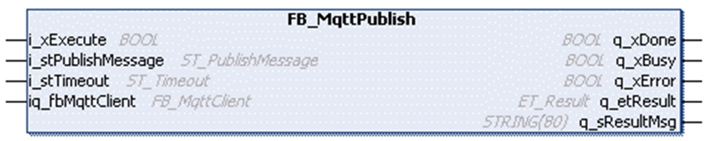
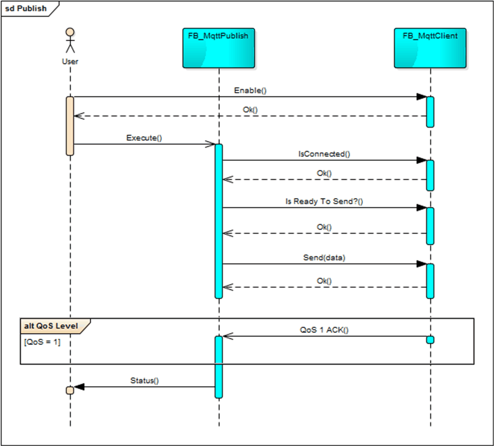

# FB\_MqttPublish

## Overview

|  |  |
| --- | --- |
| Type: | Function block |
| Available as of: | V1.0.0.0 |

## Functional Description

The function block FB\_MqttPublish is used to publish an application message on a specified topic to the MQTT server. A Publish message is sent via the previously established connection between the MQTT client and the MQTT server.

If the client is not connected, the execution of the function block is aborted without sending the message.

If the client is blocked by other processes, the function block stays in busy state. Messages are sent when the client is available again.

## Quality of Service

| Publish level | Description |
| --- | --- |
| QoS 0 | The published message is sent to the server, which does not acknowledge the message. The function block indicates q\_xDone = TRUE as soon as the message is sent. |
| QoS 1 | The published message is sent to the server, which must acknowledge the message with a PUBACK message. The function block indicates q\_xDone = TRUE as soon as the PUBACK message is received. If no PUBACK message is received, a retransmission of the published message is sent. The time span for retransmission can be [configured](#D-SE-0086580__D-SE-0086580.4). |

## Interface

| Input | Data type | Description |
| --- | --- | --- |
| i\_xExecute | BOOL | The function block publishes the specified application messages throughout the connected MQTT server upon a rising edge of this input.  Refer to [Behavior of Function Blocks with the Input i\_xExecute](i_xExecute-E1D1178E.html). |
| i\_stPublishMessage | ST\_PublishMessage | Structure to specify the application message to be published. |
| i\_stTimeout | ST\_Timeout | Structure to specify the timeouts. |
| i\_rstProperties | REFERENCE TO ST\_PropertiesPublish | Reference to the structure that contains the properties to send to the broker. |
| i\_rstResponseData | REFERENCE TO ST\_ResponseDataPublish | Reference to the structure where the properties received from the broker are written. |

| Innput/Output | Data type | Description |
| --- | --- | --- |
| iq\_fbMqttClient | FB\_MqttClient | Reference to the associated FB\_MqttClient used for the data exchange with the MQTT server. |

| Output | Data type | Description |
| --- | --- | --- |
| q\_xDone | BOOL | Indicates that the publishing of the application message was completed successfully. |
| q\_xBusy | BOOL | Indicates that the publishing of the application message is in progress. |
| q\_xError | BOOL | Indicates that an error is detected during publishing the application message. |
| q\_etResult | ET\_Result | Provides diagnostic and status information as a numeric value. |
| q\_sResultMsg | STRING [80] | Provides additional diagnostic and status information as a text message. |
| q\_xTruncatedResponseData | BOOL | When TRUE, at least one property received in the response data has been truncated or more user properties are received than defined with [Gc\_uiMaxNumberOfUserProperties](D-SE-0086551.html). |

## Usage of Variables of Type POINTER TO … or REFERENCE TO …

The function block provides inputs and/or in/outputs of type POINTER TO… or REFENCE TO…. With the use of such a pointer or reference, the function block accesses the addressed memory area. In case of an online change event, it may happen that memory areas are moved to new addresses and in consequence a pointer or reference becomes invalid. To prevent errors associated with invalid pointers, variables of type POINTER TO… or REFERENCE TO… must be updated cyclically or at least at the beginning of the cycle in which they are used.

| CAUTION | |
| --- | --- |
|  | INVALID POINTER  Verify the validity of the pointers when using pointers on addresses and executing the Online Change command.  Failure to follow these instructions can result in injury or equipment damage. |

## Unified Modeling Language (UML) Sequence Diagram

Following UML sequence diagram illustrates the interaction with the function block FB\_MqttClient, which needs to be called cyclically to process received messages and to detect a possible communication interruption to the server.

NOTE: The diagram illustrates a successful publish process and does not indicate any error handling.

EIO0000002773.04