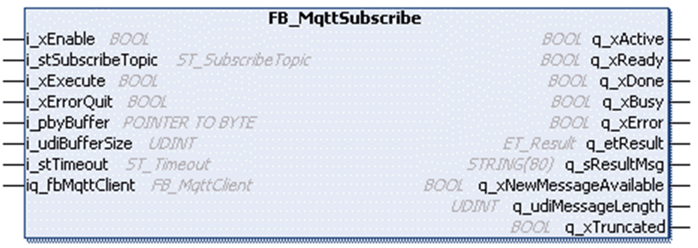
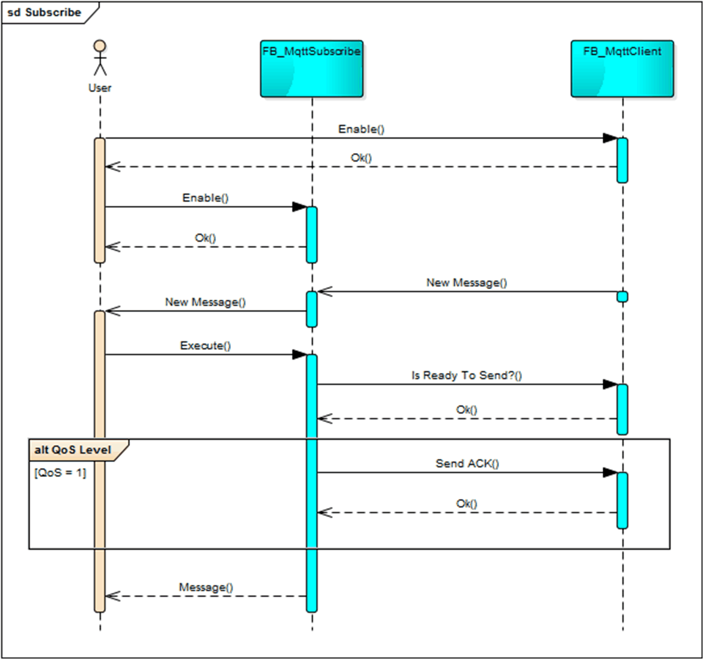

# FB\_MqttSubscribe

## Overview

|  |  |
| --- | --- |
| Type: | Function block |
| Available as of: | V1.0.0.0 |

## Functional Description

The function block FB\_MqttSubscribe is used to manage a subscription to a specific topic on the MQTT server.

The following functions are supported:

* Subscription of the specified topic
* Unsubscription of the specified topic
* Reading out of the data according to the subscribed topic

The function block uses the connection to the MQTT server that was previously established with the FB\_MqttClient.

After the function block is activated, the subscription for the specified topic is sent to the connected MQTT server.

To use wildcards in the topic name, the following conditions must be fulfilled:

* The connection is established using MQTT V 5.0.
* Topic alias maximum (udiTopicAliasMaximum) in the connect properties ([ST\_PropertiesConnect](ST_PropertiesConnect-D88C52A7.html)) is set to 0.
* The MQTT broker supports wild card subscriptions and subscription identifiers.

NOTE: Using wildcards can increase the number of received MQTT messages significantly. Refer to the response data for detailed information about the topic name of the received message.

The status of the subscription and thus the possibility of receiving data is indicated by output q\_xReady. New received data are indicated by the output q\_xNewMessage.

NOTE: If the MQTT broker supports subscription identifiers, the function block defines a unique value for this property while subscribing. This improves the performance of processing received messages.

Disabling the function block sends the unsubscription to the previously subscribed topic. The state of the unsubscription is indicated by the output q\_xActive. A new subscription is only allowed if the output q\_xActive is set to FALSE.

NOTE: To keep the session synchronized between the MQTT client and the MQTT broker, it is not possible to unsubscribe from a topic when the connection to the broker is interrupted. In this case, re-establish the connection to unsubscribe. If you reconnect to the broker with a new client ID without unsubscribing, the function block FB\_MqttSubscribe returns the diagnostic message SessionExpired to indicate that the subscription is no longer valid in this session. Reset the function block to subscribe in this new session.

After the specified topic is successfully subscribed, the data received to this topic can be read by setting the command i\_xExecute to TRUE. In case the received data is published with Quality of Service 1, a PUBACK message is sent to the MQTT broker

NOTE: A message saved inside the FB\_MqttSubscribe but not read by the application can be overwritten by a newly received message. If the overwritten message is of Quality of Service 1, it is automatically acknowledged at the MQTT broker with a PUBACK message.

NOTE: If the message received from the broker cannot be assigned to a subscribed topic, topic alias, or subscription identifier, it is ignored by the MQTT client.

## Quality of Service

| Subscribe level | Description |
| --- | --- |
| QoS 0 | The last data on the subscribed topic can be read. |
| QoS 1 | * The messages published with QoS 1 can be read. The sequence of the messages remains unchanged (First In First Out).  The first received message is stored in the function block FB\_MqttSubscribe. It can be read immediately by triggering the execution of the function block. After receiving the first message, the function block is ready to receive the next message. If the message has already been sent from the MQTT server, the function block waits for the duplicate. The time until the function block delivers the next message depends on the time until the server sends the duplicate.  When using Mosquitto as MQTT server, this can take up to 30 seconds. * The last message with QoS 0 can be read if the QoS 1 messages previously sent by the MQTT server have been received and already read.  The received QoS 0 message can be overwritten by a new message at any time. |

## Interface

| Input | Data type | Description |
| --- | --- | --- |
| i\_xEnable | BOOL | The function block sends a subscription to the specified topic to the connected MQTT server upon a rising edge of this input.  Refer to [Behavior of Function Blocks with the Inputs i\_xEnable and i\_xExecute and i\_xErrorQuit](i_xErrorQuit-145B4D67.html). |
| i\_stSubscribeTopic | ST\_SubscribeTopic | Structure to specify the topic to subscribe. |
| i\_xExecute | BOOL | The function block reads the latest received application message to the subscribed topic upon a rising edge of this input.  Refer to [Behavior of Function Blocks with the Inputs i\_xEnable and i\_xExecute and i\_xErrorQuit](i_xErrorQuit-145B4D67.html). |
| i\_xErrorQuit | BOOL | The function block acknowledges a detected error indicated by q\_xError upon a rising edge of this input.  Refer to [Behavior of Function Blocks with the Inputs i\_xEnable and i\_xExecute and i\_xErrorQuit](i_xErrorQuit-145B4D67.html). |
| i\_pbyBuffer | POINTER TO BYTE | Pointer to the buffer in which the received message is copied. |
| i\_udiBufferSize | UDINT | Size of the buffer in bytes.  NOTE: The length must not be greater than the size of the variable to which i\_pbyBuffer points to. |
| i\_stTimeout | ST\_Timeout | Structure to specify the timeouts. |
| i\_rstProperties | REFERENCE TO ST\_PropertiesPublish | Reference to the structure that contains the properties to send to the broker. |
| i\_rstResponseData | REFERENCE TO ST\_ResponseDataPublish | Reference to the structure where the properties received from the broker are written. |

| Innput/Output | Data type | Description |
| --- | --- | --- |
| iq\_fbMqttClient | FB\_MqttClient | Reference to the associated FB\_MqttClient used for the data exchange with the MQTT server. |

| Output | Data type | Description |
| --- | --- | --- |
| q\_xActive | BOOL | Indicates that the execution of the function block is active. As long this output is TRUE, the function block must be executed cyclically. |
| q\_xReady | BOOL | Indicates that the subscription to the specified topic is successfully sent to the MQTT server. |
| q\_xDone | BOOL | Indicates that the last received application message is successfully copied into the buffer specified with the input i\_pbyBuffer. |
| q\_xBusy | BOOL | Indicates that the subscription is in progress. |
| q\_xError | BOOL | Indicates that an error was detected during the execution of the function block. |
| q\_etResult | ET\_Result | Provides diagnostic and status information as a numeric value. |
| q\_sResultMsg | STRING [80] | Provides additional diagnostic and status information as a text message. |
| q\_xNewMessageAvailable | BOOL | Indicates that a new application message to the subscribed topic is available. |
| q\_udiMessageLength | UDINT | Indicates the number of bytes copied into the buffer specified with the input i\_pbyBuffer. |
| q\_xTruncated | BOOL | If this output is set to TRUE, the copied application message has been truncated. |
| q\_xTruncatedResponseData | BOOL | When TRUE, at least one property received in the response data has been truncated or more user properties are received than defined with Gc\_uiMaxNumberOfUserProperties. |

## Usage of Variables of Type POINTER TO … or REFERENCE TO …

The function block provides inputs and/or in/outputs of type POINTER TO… or REFENCE TO…. With the use of such a pointer or reference, the function block accesses the addressed memory area. In case of an online change event, it may happen that memory areas are moved to new addresses and in consequence a pointer or reference becomes invalid. To prevent errors associated with invalid pointers, variables of type POINTER TO… or REFERENCE TO… must be updated cyclically or at least at the beginning of the cycle in which they are used.

| CAUTION | |
| --- | --- |
|  | INVALID POINTER  Verify the validity of the pointers when using pointers on addresses and executing the Online Change command.  Failure to follow these instructions can result in injury or equipment damage. |

## Unified Modeling Language (UML) Sequence Diagram

Following UML sequence diagram illustrates the interaction with the function block FB\_MqttClient, which needs to be called cyclically to process received messages and to detect a possible communication interruption to the server.

NOTE: The diagram illustrates a successful subscribe process and does not indicate any error handling.

EIO0000002773.04