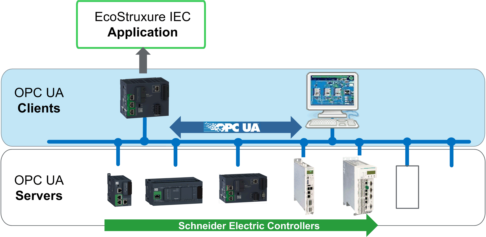

# General Information

## Library Overview

The OpcUaHandling library provides you the function blocks to implement the OPC UA client functionality in your application. The OPC UA client itself is a component in the runtime system (controller firmware). The function blocks are applied to control and monitor the client from the application, and thus to implement the data exchange with the OPC UA server.

For more information about the OPC especially OPC UA, refer to the official webpage of the OPC Foundation at <https://opcfoundation.org>.

Also refer to [*General Information on Function Blocks*](D-SE-0100004.html#D-SE-0100004).

## Characteristics of the Library

The table indicates the characteristics of the library:

| Characteristic | Value |
| --- | --- |
| Library title | OpcUaHandling |
| Company | Schneider Electric |
| Category | Communication |
| Component | OPC UA Handling |
| Default namespace | SE\_OPC |
| Language model attribute | [Qualified-access-only](../../../../../api/crossBook?lang=en-US&virtualBookName=SoLibref&topicID=D_SE_0081219) |
| Forward compatible library | Yes ([FCL](../../../../../api/crossBook?lang=en-US&virtualBookName=SoLibref&topicID=D_SE_0081226)) |

NOTE: For this library, qualified-access-only is set. This means, that the POUs, data structures, enumerations, and constants have to be accessed using the namespace of the library. The default namespace of the library is SE\_OPC.

## Controller Platforms

To identify the controllers that are compatible with the library, refer to the [List of Controllers Compatible with your Libraries](../../../../../api/crossBook?lang=en-US&virtualBookName=SoLibOv&topicID=D_SE_0096069).

## Compatibility/Conformity

The function blocks and data types provided with the library are compliant with the PLCopen specification *PLCopen OPC-UA Client for IEC61131-3 version 1.1*.

## Example Project

In conjunction with the library, an example project is provided. The example project demonstrates how to implement the components from the OpcUaHandling library.

NOTE: The following instructions pertain to EcoStruxure Machine Expert ≤V2.3. In EcoStruxure Machine Expert V2.5, use the EcoStruxure Machine Expert - portal to open a new project. For more information, refer to the [Home Page chapter of the EcoStruxure Machine Expert Portal User Guide](../../../../../api/crossBook?lang=en-US&virtualBookName=esmepug&topicID=LaunchingPortalHomePageAndAutomatio_01C65C3B).

The example project is installed on your PC along with the programming software. To open the project example, proceed as follows:

| Step | Action | Result |
| --- | --- | --- |
| 1 | In EcoStruxure Machine Expert ≤V2.3, run the command File > New Project. | – |
| 2 | In the New Project dialog box, select the option From Example from the Project type list. | – |
| 3 | On the right-hand side of the New Project dialog box, click Toggle Filter. | Available examples are listed in the drop down menu. |
| 4 | Select your example from the drop-down menu. | – |
| 5 | Select your controller from the Controllers list. | – |
| 6 | Enter a name for the project, and select the file location. | – |
| 7 | Click OK. | A project is created based on the selected example. |

EIO0000004021.06