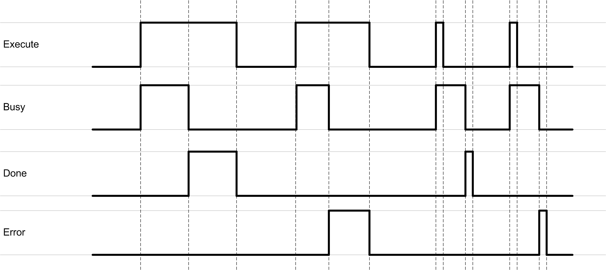

# Behavior of Function Blocks with the Input Execute

## General Information

A rising edge of the input Execute starts the execution of the function block. The function block continues execution and the output Busy is set to TRUE. Additional rising edges at the input Execute are ignored while the function block is being executed.

Once the execution is finished, the outputs Done or Error remain TRUE until the input Execute is set to FALSE. If the input is reset before the execution is finished, the outputs Done or Error are set to TRUE for one cycle.

## Example

EIO0000004021.06