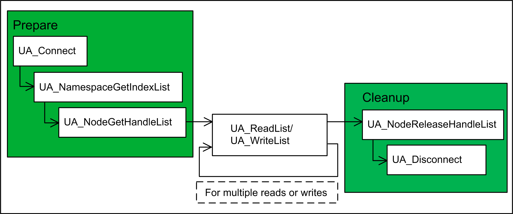
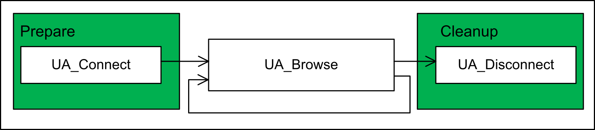
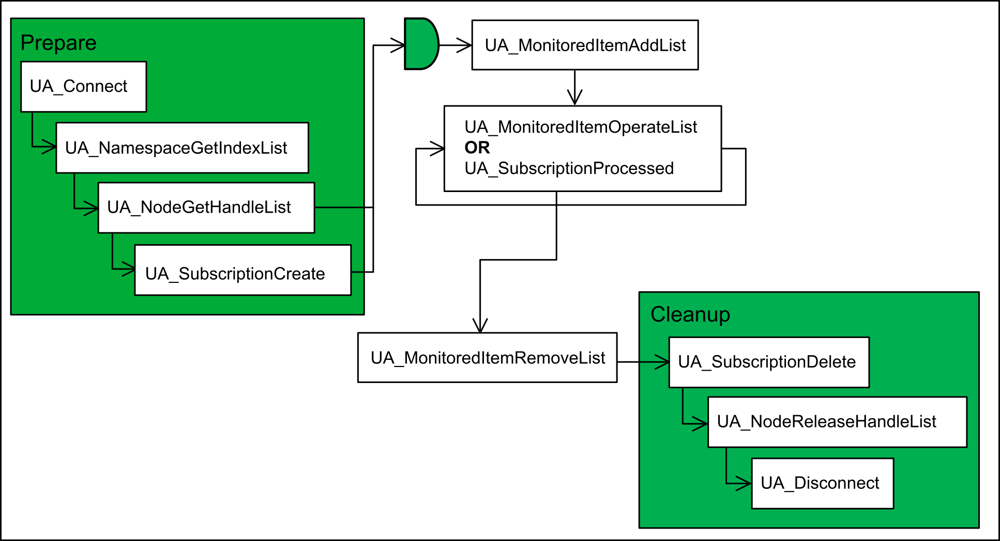
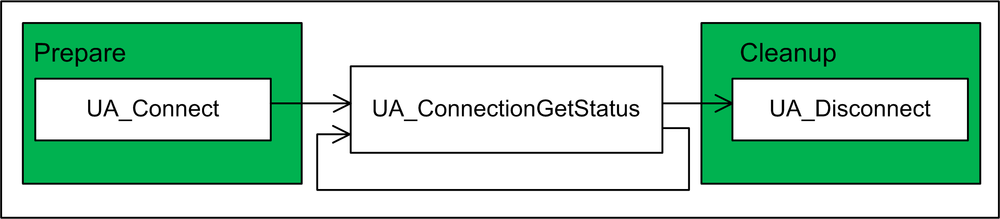
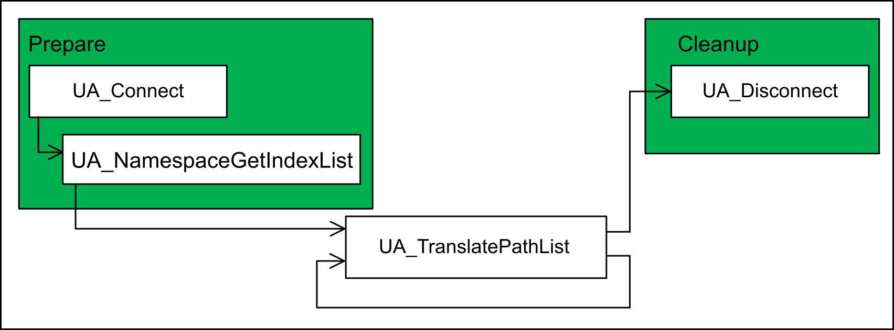

# General Information on Function Blocks

## Sequences for Communication

The diagrams below indicate the correlation of the function blocks to implement.

The simultaneous execution of function blocks using the same connection handle is not allowed. The function block executed using an occupied connection handle reports the error ID 16#A0000002, which stands for PLCopenUA\_Bad\_FW\_TempError.

The following steps must be executed in your application to read or write a list of variables:



The UA\_Connect function block is used to create a transport connection of an OPC UA session. The function block UA\_NamespaceGetIndexList must be executed to get the namespaces of the connected OPC UA server. They are required to retrieve the node handles by executing the function block UA\_NodeGetHandleList. Reading and writing attributes of the nodes can be performed multiple times. After the communication has been finished, the node handles are no longer required. It is a good practice to release them by executing the UA\_NodeReleaseHandleList function block for all handles. Execute the UA\_Disconnect function block to release the connection handle.

NOTE: In case of an online change of the application, the OPC UA client will be reinitialized. Consequently, the ongoing processes will be aborted and all connections closed.

The following steps must be executed in your application to browse the address space on the server:



The following steps must be executed to process a subscription of a list of nodes:



The client application initiates the communication and the values are published by the OPC UA server. As indicated in the block diagram above, a subscription and monitored items must be set up.

The following steps must be executed to get the present connection status:



You can call the function block UA\_ConnectionGetStatus periodically. For performance reasons, do not execute it in every control program cycle.

The following steps must be executed to get the node parameters using the node path:



## Code Example

**Declaration**

```
PROGRAM Example
VAR
    fbUaConnect : SE_Opc.UA_Connect;
    fbUaNamespaceGetIndexList       : SE_Opc.UA_NamespaceGetIndexList;
    fbUaNodeGetHandleList           : SE_Opc.UA_NodeGetHandleList;
    fbUaReadList                    : SE_Opc.UA_ReadList;
    fbUaNodeReleaseHandleList       : SE_Opc.UA_NodeReleaseHandleList;
    fbUaDisconnect                  : SE_Opc.UA_Disconnect;
    fbUaConnectionGetStatus         : SE_Opc.UA_ConnectionGetStatus;

    stSessionConnectInfo            : SE_Opc.UASessionConnectInfo;
    dwConnectionHdl                 : DWORD;
    auiNamespaceIndexes             : ARRAY [1..SE_Opc.GPL.MAX_ELEMENTS_NAMESPACES] OF UINT;
    asNamespaceUris                 : ARRAY [1..SE_Opc.GPL.MAX_ELEMENTS_NAMESPACES] OF STRING(255);
    astNodeIds                      : ARRAY [1..SE_Opc.GPL.MAX_ELEMENTS_NODELIST] OF SE_Opc.UANodeID;
    adwNodeHdls                     : ARRAY [1..SE_Opc.GPL.MAX_ELEMENTS_NODELIST] OF DWORD;
    astNodeAddInfos                 : ARRAY [1..SE_Opc.GPL.MAX_ELEMENTS_NODELIST] OF SE_Opc.UANodeAdditionalInfo;
    astVariables                    : ARRAY [1..SE_Opc.GPL.MAX_ELEMENTS_NODELIST] OF SE_Opc.ST_Variable;
    iReadValue                      : INT;
    xOpcCommunicationOk             : BOOL;
    iState                          : INT;
    xCmdConnect                     : BOOL;
    xCmdReadVariable                : BOOL;
    xCmdCyclicReadVariable          : BOOL;
    xCmdDisconnect                  : BOOL;
END_VAR
```

Program

```
CASE iState OF
    0:  // Idle
        IF xCmdConnect THEN
            xCmdConnect := FALSE;

           stSessionConnectInfo.UserIdentityToken.UserIdentityTokenType := SE_Opc.UAUserIdentityTokenType.UAUITT_Username;
           stSessionConnectInfo.UserIdentityToken.TokenParam1 := 'Administrator';
           stSessionConnectInfo.UserIdentityToken.TokenParam2 := 'Password';

           fbUaConnect(    Execute:= TRUE,  
                             ServerEndpointUrl:= 'opc.tcp://10.128.154.220:4840',
                                  SessionConnectInfo:= stSessionConnectInfo);

           iState := 10;
        END_IF

     10: // Connecting
        fbUaConnect();
        IF fbUaConnect.Done THEN
            dwConnectionHdl := fbUaConnect.ConnectionHdl;
            fbUaConnect (Execute := FALSE);

            asNamespaceUris[1] := 'http://www.unifiedautomation.com/customprovider/';

            fbUaNamespaceGetIndexList( Execute:= TRUE, 
                                       ConnectionHdl:= dwConnectionHdl,
                                       NamespaceUrisCount:= 1,
                                       NamespaceUris:= asNamespaceUris,
                                       NamespaceIndexes=> auiNamespaceIndexes);

            iState := 20;
        ELSIF fbUaConnect.Error THEN
             ; // Add error handling here
        END_IF

     20: // Wait for IndexList
        fbUaNamespaceGetIndexList();
        IF fbUaNamespaceGetIndexList.Done THEN

            IF fbUaNamespaceGetIndexList.ErrorIDs[1] = SE_Opc.ET_Result.OpcUa_Good THEN
                auiNamespaceIndexes := fbUaNamespaceGetIndexList.NamespaceIndexes;
                fbUaNamespaceGetIndexList(Execute := FALSE);

                astNodeIds[1].IdentifierType := SE_Opc.UAIdentifierType.UAIT_String;
                astNodeIds[1].Identifier := 'Application.GVL.G_iVariableToRead';
                astNodeIds[1].NamespaceIndex := auiNamespaceIndexes[1];

                fbUaNodeGetHandleList( Execute:= TRUE,
                                       ConnectionHdl:= dwConnectionHdl,
                                       NodeIDCount:= 1,
                                       NodeIDs:= astNodeIds);

                iState := 30;
           ELSE
                ; // Add error handling here
           END_IF
        ELSIF fbUaNamespaceGetIndexList.Error THEN
            ; // Add error handling here
        END_IF

    30: // Wait for HandleList
        fbUaNodeGetHandleList();
        IF fbUaNodeGetHandleList.Done THEN
            IF fbUaNodeGetHandleList.NodeErrorIDs[1] = SE_Opc.ET_Result.OpcUa_Good THEN
                adwNodeHdls := fbUaNodeGetHandleList.NodeHdls;
                fbUaNodeGetHandleList(Execute := FALSE);
                iState := 100;
            ELSE
                ; // Add error handling here
            END_IF
        ELSIF fbUaNodeGetHandleList.Error THEN
                ; // Add error handling here
        END_IF

    100:// client is connected, ready for read & write variables
        IF xCmdDisconnect THEN
           xCmdDisconnect := FALSE;

           fbUaNodeReleaseHandleList( Execute:= TRUE,#
                                      ConnectionHdl:= dwConnectionHdl,
                                      NodeHdlCount:= 1,
                                      NodeHdls:= adwNodeHdls);
           iState := 200;
        ELSIF xCmdReadVariable OR xCmdCyclicReadVariable THEN
            xCmdReadVariable := FALSE;

            astNodeAddInfos[1].AttributeID := SE_Opc.UAAttributeID.UAAI_Value;
            astNodeAddInfos[1].IndexRangeCount := 0;

            astVariables[1].etNodeDataType := SE_Opc.ET_VarType.UATypeInt16;
            astVariables[1].pbyBuffer := ADR(iReadValue);
            astVariables[1].udiBufferSize := SIZEOF(iReadValue);

            fbUaReadList( Execute:= TRUE, 
                          ConnectionHdl:= dwConnectionHdl,
                          NodeHdlCount:= 1,
                          NodeHdls:= adwNodeHdls, 
                          NodeAddInfos:= astNodeAddInfos, 
                          Variables:= astVariables);

            iState := 110;
        ELSE
            fbUaConnectionGetStatus( Execute:= TRUE, 
                                     ConnectionHdl:= dwConnectionHdl);

            iState := 120;
        END_IF

    110:// Wait for read operatin done
        fbUaReadList(Variables:= astVariables);
        IF fbUaReadList.Done THEN
            IF fbUaReadList.NodeErrorIDs[1] = SE_Opc.ET_Result.OpcUa_Good THEN
              ; // Read value is valid and can be processed here
            ELSE
              ; // Add error handling here
            END_IF
            fbUaReadList(Execute := FALSE, Variables:= astVariables);
            iState := 100;
        ELSIF fbUaReadList.Error THEN
            ; // Add error handling here
        END_IF

    120:// Wait for connection status
        fbUaConnectionGetStatus();
        IF fbUaConnectionGetStatus.Done THEN
            IF fbUaConnectionGetStatus.ServerState = SE_Opc.UAServerState.UASS_Running AND
                fbUaConnectionGetStatus.ConnectionStatus = SE_Opc.UAConnectionStatus.UACS_Connected THEN
                xOpcCommunicationOk := TRUE;
            ELSE
                // Add handling of communication interruption here
                xOpcCommunicationOk := FALSE;
            END_IF
            fbUaConnectionGetStatus (Execute := FALSE);
            iState := 100;
        ELSIF fbUaConnectionGetStatus.Error THEN
            ; // Add error handling here
        END_IF

    200:// Wait for HandleList is released
        fbUaNodeReleaseHandleList();
        IF fbUaNodeReleaseHandleList.Done THEN
            IF fbUaNodeReleaseHandleList.NodeErrorIDs[1] = SE_Opc.ET_Result.OpcUa_Good THEN
               fbUaNodeReleaseHandleList(Execute := FALSE);

               fbUaDisconnect( Execute:= TRUE,  
                               ConnectionHdl:= dwConnectionHdl);

               iState := 210;
            ELSE
                ; // Add error handling here
            END_IF
        ELSIF fbUaNodeReleaseHandleList.Error THEN
            ; // Add error handling here
        END_IF

    210:// Wait for disconnection done
        fbUaDisconnect();
        IF fbUaDisconnect.Done THEN
            fbUaDisconnect( Execute:= FALSE);
            iState := 0;
        ELSIF fbUaDisconnect.Error THEN
            ; // Add error handling here
        END_IF
END_CASE
```

EIO0000004021.06