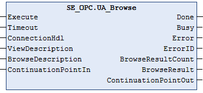

# UA\_Browse

## Overview

|  |  |
| --- | --- |
| Type: | Function block |
| Available as of: | V2.0.0.0 |

## Functional Description

The function block UA\_Browse is used to navigate through the address space. After a starting node, the server returns a list of nodes by references. If not all nodes are returned, assign the output ContinuationPointOut to the input ContinuationPointIn and re-execute the function block.

After successful function block execution, the output ContinuationPointOut is set to 0 to indicate that the browse request has been completed and that the results have been returned. Up to 10 ongoing browse requests can be handled in the internal buffer of the function block.

To delete the internal buffer, execute one of the following actions:

* Call FB\_Browse by setting the input ContinuationPointIn to `16#FFFFFFFF`: No browse request is executed, but the internal buffer is reset.
* Call UA\_Disconnect to disconnect the OPC UA client.
* Execute the Online > Reset Cold command to reset the application.

## Interface

| Input | Data type | Description |
| --- | --- | --- |
| Execute | BOOL | Upon a rising edge, the function block is being executed.  Also refer to [*Behavior of Function Blocks with the Input Execute*](D-SE-0100307.html#D-SE-0100307__D-SE-0100307.7). |
| Timeout | TIME | Maximum time to respond.  Value range: 2 s...60 s  If the value is out of range the upper or lower limit is applied.  Default value: GPL.Timeout |
| ConnectionHdl | DWORD | Connection handle. |
| ViewDescription | UAViewDescription | Not used.  Default value: empty |
| BrowseDescription | UABrowseDescription | Starting node and other information for navigation.  NOTE: This parameter is ignored if the input ContinuationPointIn is not 0. |
| ContinuationPointIn | DWORD | * If set to 0, the browse process starts with the starting node. * If set to ContinuationPointOut, a browse next service can be performed.   NOTE: PacDrive LMC controllers support ContinuationPointIn from the server if it is limited to unsigned integer of 32 bits. |

| Output | Data type | Description |
| --- | --- | --- |
| Done | BOOL | Indicates that the execution of the function block was completed successfully. |
| Busy | BOOL | Indicates that the execution of the function block is in progress. |
| Error | BOOL | Indicates that an error was detected during execution.  NOTE: Even if Error indicates FALSE, verify the corresponding ErrorIDs before processing the namespace indexes. |
| ErrorID | [ET\_Result](D-SE-0099997.html#D-SE-0099997__D-SE-0099997.5) | Provides additional diagnostic information as a numeric value.  For each specified namespace URI, a separate result is provided. |
| BrowseResultCount | UINT | Indicates the number of entries inside the BrowseResult array. |
| BrowseResult | ARRAY [1..GPL. MAX\_ELEMENTS\_NODELIST] OF UAReferenceDescription | Contains references and target node information for the nodes passing the filter criteria in the request. |
| ContinuationPointOut | DWORD | Indicates that the server was not able to deliver all the results. Can be copied to ContinuationPointIn for browse next service.  NOTE: PacDrive LMC controllers support ContinuationPointOut from the server if it is limited to unsigned integer of 32 bits. |

EIO0000004021.06