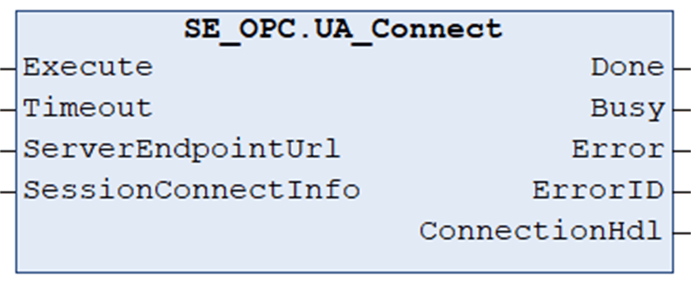

# UA\_Connect

## Overview

|  |  |
| --- | --- |
| Type: | Function block |
| Available as of: | V1.0.0.0 |

## Functional Description

The function block UA\_Connect is used to create a transport connection and an OPC UA session.

NOTE:

Before executing the function block UA\_Connect, enable the OPC UA stack on your controller:

* For Modicon M262 Logic/Motion Controllers, activate the option OPC UA Server enabled in the OPC UA Server Configuration tab of the device editor.
* For PacDrive controllers, call the function SystemInterface.FC\_OpcUaStart once in the initialization of your application.

The function block UA\_Connect must be executed once for each connection. The connection is terminated by calling the UA\_Disconnect function block.

NOTE: The connection monitoring and the reconnect handling must be implemented separately within your application. Refer to OPC UA specification part 4.

## Interface

| Input | Data type | Description |
| --- | --- | --- |
| Execute | BOOL | Upon a rising edge, the function block is being executed.  Also refer to [*Behavior of Function Blocks with the Input Execute*](D-SE-0100307.html#D-SE-0100307__D-SE-0100307.7). |
| Timeout | TIME | Maximum time to respond.  Value range: 2 s...60 s  If the value is out of range the upper or lower limit is applied.  Default value: GPL.Timeout |
| ServerEndpointUrl | STRING [255] | URL of the server to connect to. For example, *opc.tcp://10.128.154.220:4840*.  This string must not be a null string. |
| SessionConnectInfo | [UASessionConnectInfo](D-SE-0099964.html#D-SE-0099964__D-SE-0099964.2) | Structure to specify the connection information required to create an OPC UA session. |

| Output | Data type | Description |
| --- | --- | --- |
| Done | BOOL | Indicates that the execution of the function block was completed successfully. |
| Busy | BOOL | Indicates that the execution of the function block is in progress. |
| Error | BOOL | Indicates that an error was detected during execution.  NOTE: Even if Error indicates FALSE, verify the corresponding ErrorIDs before processing the namespace indexes. |
| ErrorID | [ET\_Result](D-SE-0099997.html#D-SE-0099997__D-SE-0099997.5) | Provides additional diagnostic information as a numeric value.  For each specified namespace URI, a separate result is provided. |
| ConnectionHdl | DWORD | Connection handle valid until UA\_Disconnect is called. |

EIO0000004021.06