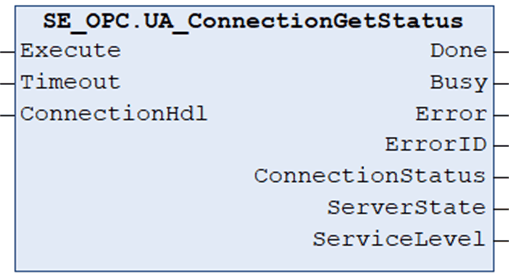

# UA\_ConnectionGetStatus

## Overview

|  |  |
| --- | --- |
| Type: | Function block |
| Available as of: | V1.0.0.0 |

## Functional Description

The function block UA\_ConnectionGetStatus is used to get the connection status of a specified connection.

## Interface

| Input | Data type | Description |
| --- | --- | --- |
| Execute | BOOL | Upon a rising edge, the function block is being executed.  Also refer to [*Behavior of Function Blocks with the Input Execute*](D-SE-0100307.html#D-SE-0100307__D-SE-0100307.7). |
| Timeout | TIME | Maximum time to respond.  Value range: 2 s...60 s  If the value is out of range the upper or lower limit is applied.  Default value: GPL.Timeout |
| ConnectionHdl | DWORD | Connection handle. |

| Output | Data type | Description |
| --- | --- | --- |
| Done | BOOL | Indicates that the execution of the function block was completed successfully. |
| Busy | BOOL | Indicates that the execution of the function block is in progress. |
| Error | BOOL | Indicates that an error was detected during execution.  NOTE: Even if Error indicates FALSE, verify the corresponding ErrorIDs before processing the namespace indexes. |
| ErrorID | [ET\_Result](D-SE-0099997.html#D-SE-0099997__D-SE-0099997.5) | Provides additional diagnostic information as a numeric value.  For each specified namespace URI, a separate result is provided. |
| ConnectionStatus | [UAConnectionStatus](D-SE-0099980.html#D-SE-0099980__D-SE-0099980.3) | Indicates the connection status. |
| ServerState | [UAServerState](D-SE-0099978.html#D-SE-0099978__D-SE-0099978.3) | Indicates the server status. |
| ServiceLevel | BYTE | Indicates the ability of the server to provide its data to the client. The value range is from 0...255, where 0 indicates the lowest and 255 indicates the highest level. The intent is to provide the clients an indication of availability among redundant servers. |

EIO0000004021.06