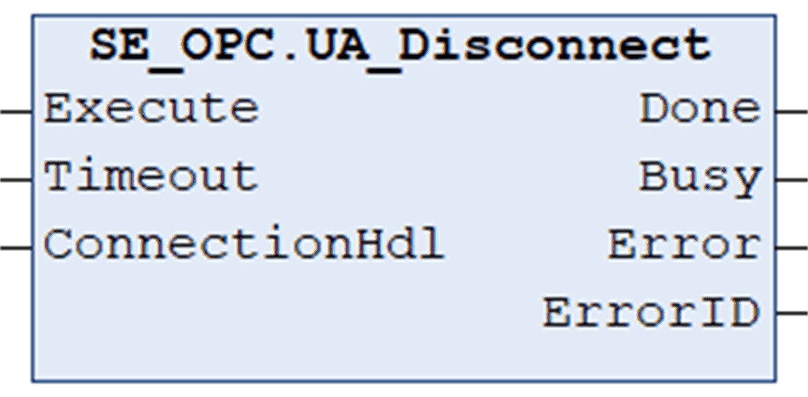

# UA\_Disconnect

## Overview

|  |  |
| --- | --- |
| Type: | Function block |
| Available as of: | V1.0.0.0 |

## Functional Description

The function block UA\_Disconnect is used to close the specified transport connection of an OPC UA session.

NOTE: Regardless of the result of executing, the function block UA\_Disconnect releases the connection handle and all node handles of the specified connection.

## Interface

| Input | Data type | Description |
| --- | --- | --- |
| Execute | BOOL | Upon a rising edge, the function block is being executed.  Also refer to [*Behavior of Function Blocks with the Input Execute*](D-SE-0100307.html#D-SE-0100307__D-SE-0100307.7). |
| Timeout | TIME | Maximum time to respond.  Value range: 2 s...60 s  If the value is out of range the upper or lower limit is applied.  Default value: GPL.Timeout |
| ConnectionHdl | DWORD | Connection handle. |

| Output | Data type | Description |
| --- | --- | --- |
| Done | BOOL | Indicates that the execution of the function block was completed successfully. |
| Busy | BOOL | Indicates that the execution of the function block is in progress. |
| Error | BOOL | Indicates that an error was detected during execution.  NOTE: Even if Error indicates FALSE, verify the corresponding ErrorIDs before processing the namespace indexes. |
| ErrorID | [ET\_Result](D-SE-0099997.html#D-SE-0099997__D-SE-0099997.5) | Provides additional diagnostic information as a numeric value.  For each specified namespace URI, a separate result is provided. |

EIO0000004021.06