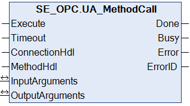

# UA\_MethodCall

## Overview

|  |  |
| --- | --- |
| Type: | Function block |
| Available as of: | V2.2.4.0 |

## Functional Description

The function block UA\_MethodCall is used to execute a method call with the possibility to send and to receive a set of arguments. The implementation of the method is done on the OPC UA server.

NOTE: To help avoid an inconsistent response, do not modify parameters while the function block is executing (Busy = TRUE).

| WARNING | |
| --- | --- |
|  | UNINTENDED EQUIPMENT OPERATION  Do not modify input parameters while the Busy output is equal to TRUE.  Failure to follow these instructions can result in death, serious injury, or equipment damage. |

NOTE: Arguments with data type ET\_VarType.UATypeLocalizedText are exclusive to Modicon M262 Logic/Motion Controllers with firmware version V5.2.8.27 or greater.

## Interface

| Input | Data type | Description |
| --- | --- | --- |
| Execute | BOOL | Upon a rising edge, the function block is being executed.  Also refer to [*Behavior of Function Blocks with the Input Execute*](D-SE-0100307.html#D-SE-0100307__D-SE-0100307.7). |
| Timeout | TIME | Maximum time to respond.  Value range: 2 s...60 s  If the value is out of range the upper or lower limit is applied.  Default value: GPL.Timeout |
| ConnectionHdl | DWORD | Connection handle. |
| MethodHdl | DWORD | Method handle returned by the function block [UA\_MethodGetHandleList](UA_MethodGetHandleList-9B5262BA.html). |

| Inputs / Outputs | Data type | Description |
| --- | --- | --- |
| InputArguments | [ST\_Arguments](ST_Arguments-9B42BFB3.html) | Structure containing the arguments to send to the OPC UA server. |
| OutputArguments | [ST\_Arguments](ST_Arguments-9B42BFB3.html) | Structure containing the arguments received from the OPC UA server. |

| Output | Data type | Description |
| --- | --- | --- |
| Done | BOOL | Indicates that the execution of the function block was completed successfully. |
| Busy | BOOL | Indicates that the execution of the function block is in progress. |
| Error | BOOL | Indicates that an error was detected during execution.  NOTE: Even if Error indicates FALSE, verify the corresponding ErrorIDs before processing the namespace indexes. |
| ErrorID | [ET\_Result](D-SE-0099997.html#D-SE-0099997__D-SE-0099997.5) | Provides additional diagnostic information as a numeric value.  For each specified namespace URI, a separate result is provided. |

EIO0000004021.06