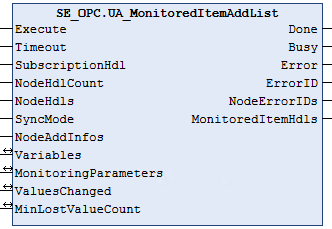

# UA\_MonitoredItemAddList

## Overview

|  |  |
| --- | --- |
| Type: | Function block |
| Available as of: | V2.0.0.0 |

## Functional Description

The function block UA\_MonitoredItemAddList is used to add monitored items to a subscription using a list of node handles.

The function block updates the values of SamplingTime and QueueSize by using the input/output parameter MonitoringParameters.

The remaining input/output parameters are updated separately depending on the selected [SyncMode](TPC_OpcUaLib_UAMonitoringSyncMode-84297FDA.html):

* For SyncMode UAMS\_ControllerSync, call the function block UA\_MonitoredItemOperateList for updating values.
* For SyncMode UAMS\_FwSync, the firmware updates the values automatically according to the interval configured with the input/output [PublishingInterval](UA_SubscriptionCreate-FunctionalDes-80784164.html#UA_SubscriptionCreate-FunctionalDes-80784164__Interface-80797F7A) for the subscription. The function block UA\_SubscriptionProcessed can be called optionally to verify whether the new values have been published.

NOTE: The SyncMode UAMS\_FwSync is only compatible using the NodeDataType UATypeIECSymbol to reference variables of base data types with a maximum size of 8 bytes. For further information on UATypeIECSymbol, refer to [ET\_VarType](D-SE-0099976.html).

NOTE: A data type mismatch between an item to be monitored specified at the input/output variables and the corresponding variable declared on the server side cannot be detected. When a data type mismatch occurs, an implicit conversion is performed.

NOTE: ByteString is represented as a one-dimensional ARRAY OF BYTE on the client side. If ByteString is declared on the server side, use a buffer of type ARRAY OF BYTE and NodeDataType UATypeByte.

NOTE: The function block does not support the MaxAge feature specified by the OPC UA protocol.

## Interface

| Input | Data type | Description |
| --- | --- | --- |
| Execute | BOOL | Upon a rising edge, the function block is being executed.  Also refer to [*Behavior of Function Blocks with the Input Execute*](D-SE-0100307.html#D-SE-0100307__D-SE-0100307.7). |
| Timeout | TIME | Maximum time to respond.  Value range: 2 s...60 s  If the value is out of range the upper or lower limit is applied.  Default value: GPL.Timeout |
| SubscriptionHdl | DWORD | Subscription handle. |
| NodeHdlCount | UINT | Number of node handles in the NodeHdls array.  Value range: 1..GPL.MAX\_ELEMENTS\_NODELIST] |
| NodeHdls | ARRAY [1..GPL. MAX\_ELEMENTS\_MONITORLIST] OF DWORD | Array containing node handles. |
| SyncMode | UAMonitoringSyncMode | Synchronization mode. |
| NodeAddInfos | ARRAY [1..GPL. MAX\_ELEMENTS\_MONITORLIST] OF UANodeAdditionalInfo | Array containing additional node information like attribute and index range. |

| Input/Output | Data type | Description |
| --- | --- | --- |
| Variables | ARRAY [1..GPL. MAX\_ELEMENTS\_MONITORLIST] OF UAMonitoredVariables | Array containing information about the variables to read and the corresponding memory areas.  NOTE: Do not process the variables until the function block indicates Done. |
| MonitoringParameters | ARRAY [1..GPL. MAX\_ELEMENTS\_MONITORLIST] OF UAMonitoringParameter | Array containing monitoring parameters for each valid element of the NodeHdls array. |
| ValuesChanged | ARRAY [1..GPL. MAX\_ELEMENTS\_MONITORLIST] OF BOOL | Indicates that the values of the monitored item have been modified. |
| MinLostValueCount | ARRAY [1..GPL. MAX\_ELEMENTS\_MONITORLIST] OF UINT | Indicates the number of missed values if the queue size is greater than 1 in case the queue size on the client side is smaller than the queue size on the server side. |

| Output | Data type | Description |
| --- | --- | --- |
| Done | BOOL | Indicates that the execution of the function block was completed successfully. |
| Busy | BOOL | Indicates that the execution of the function block is in progress. |
| Error | BOOL | Indicates that an error was detected during execution.  NOTE: Even if Error indicates FALSE, verify the corresponding ErrorIDs before processing the namespace indexes. |
| ErrorID | [ET\_Result](D-SE-0099997.html#D-SE-0099997__D-SE-0099997.5) | Provides additional diagnostic information as a numeric value.  For each specified namespace URI, a separate result is provided. |
| NodeErrorIDs | ARRAY [1..GPL. MAX\_ELEMENTS\_MONITORLIST] OF ET\_Result | Contains an error value for each element of the NodeHdls array. |
| MonitoredItemHdls | ARRAY [1..GPL. MAX\_ELEMENTS\_NODELIST] OF DWORD | Contains monitored item handles for each valid element of the NodeHdls array. |

EIO0000004021.06