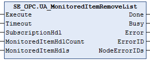

# UA\_MonitoredItemRemoveList

## Overview

|  |  |
| --- | --- |
| Type: | Function block |
| Available as of: | V2.0.0.0 |

## Functional Description

The function block UA\_MonitoredItemRemoveList is used to remove monitored items from a subscription using a list of monitored item handles and the corresponding subscription handle.

## Interface

| Input | Data type | Description |
| --- | --- | --- |
| Execute | BOOL | Upon a rising edge, the function block is being executed.  Also refer to [*Behavior of Function Blocks with the Input Execute*](D-SE-0100307.html#D-SE-0100307__D-SE-0100307.7). |
| Timeout | TIME | Maximum time to respond.  Value range: 2 s...60 s  If the value is out of range the upper or lower limit is applied.  Default value: GPL.Timeout |
| SubscriptionHdl | DWORD | Subscription handle. |
| MonitoredItemHdlCount | UINT | Number of monitored item handles in the MonitoredItemHdls array. |
| MonitoredItemHdls | ARRAY [1..GPL. MAX\_ELEMENTS\_MONITORLIST] OF DWORD | Array containing the monitored item handles to be removed. |

| Output | Data type | Description |
| --- | --- | --- |
| Done | BOOL | Indicates that the execution of the function block was completed successfully. |
| Busy | BOOL | Indicates that the execution of the function block is in progress. |
| Error | BOOL | Indicates that an error was detected during execution.  NOTE: Even if Error indicates FALSE, verify the corresponding ErrorIDs before processing the namespace indexes. |
| ErrorID | [ET\_Result](D-SE-0099997.html#D-SE-0099997__D-SE-0099997.5) | Provides additional diagnostic information as a numeric value.  For each specified namespace URI, a separate result is provided. |
| NodeErrorIDs | ARRAY [1..GPL. MAX\_ELEMENTS\_MONITORLIST] OF ET\_Result | Contains an error value for each element of the MonitoredItemHdls array. |

EIO0000004021.06