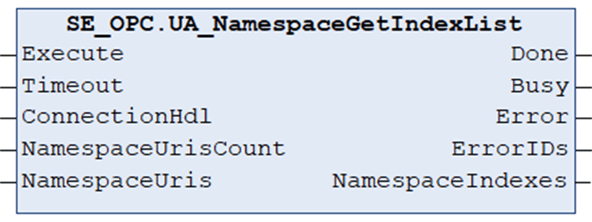

# UA\_NamespaceGetIndexList

## Overview

|  |  |
| --- | --- |
| Type: | Function block |
| Available as of: | V1.0.0.0 |

## Functional Description

The function block UA\_NamespaceGetIndexList is used to get the namespace indexes of several namespace URIs.

NOTE: The function block reads the server object NamespaceArray and returns the indexes of the requested elements. The namespace index is an element within the structure UANodeID, which is required for subsequently used [function blocks](D-SE-0100004.html#D-SE-0100004__D-SE-0100004.3).

NOTE: To help avoid an inconsistent response, do not modify parameters while the function block is executing (Busy = TRUE).

| WARNING | |
| --- | --- |
|  | UNINTENDED EQUIPMENT OPERATION  Do not modify input parameters while the Busy output is equal to TRUE.  Failure to follow these instructions can result in death, serious injury, or equipment damage. |

## Interface

| Input | Data type | Description |
| --- | --- | --- |
| Execute | BOOL | Upon a rising edge, the function block is being executed.  Also refer to [*Behavior of Function Blocks with the Input Execute*](D-SE-0100307.html#D-SE-0100307__D-SE-0100307.7). |
| Timeout | TIME | Maximum time to respond.  Value range: 2 s...60 s  If the value is out of range the upper or lower limit is applied.  Default value: GPL.Timeout |
| ConnectionHdl | DWORD | Connection handle. |
| NamespaceUrisCount | UINT | Number of namespace URIs in NamespaceUris array.  Value range: 1.. GPL.MAX\_ELEMENTS\_NAMESPACES |
| NamespaceUris | ARRAY [1..GPL.MAX\_ELEMENTS\_NAMESPACES] OF STRING [255] | Array containing namespace URIs. |

| Output | Data type | Description |
| --- | --- | --- |
| Done | BOOL | Indicates that the execution of the function block was completed successfully. |
| Busy | BOOL | Indicates that the execution of the function block is in progress. |
| Error | BOOL | Indicates that an error was detected during execution.  NOTE: Even if Error indicates FALSE, verify the corresponding ErrorIDs before processing the namespace indexes. |
| ErrorIDs | ARRAY [1..GPL.MAX\_ELEMENTS\_NAMESPACES] OF [ET\_Result](D-SE-0099997.html#D-SE-0099997__D-SE-0099997.5) | Provides additional diagnostic information as a numeric value.  For each specified namespace URI, a separate result is provided. |
| NamespaceIndexes | ARRAY [1..GPL.MAX\_ELEMENTS\_NAMESPACES] OF UINT | Provides retrieved namespace indexes. |

EIO0000004021.06