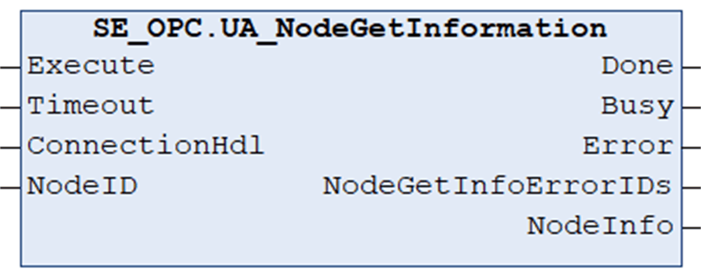

# UA\_NodeGetInformation

## Overview

|  |  |
| --- | --- |
| Type: | Function block |
| Available as of: | V1.0.0.0 |

## Functional Description

The function block UA\_NodeGetInformation is used to get node information.

NOTE: To help avoid an inconsistent response, do not modify parameters while the function block is executing (Busy = TRUE).

| WARNING | |
| --- | --- |
|  | UNINTENDED EQUIPMENT OPERATION  Do not modify input parameters while the Busy output is equal to TRUE.  Failure to follow these instructions can result in death, serious injury, or equipment damage. |

## Interface

| Input | Data type | Description |
| --- | --- | --- |
| Execute | BOOL | Upon a rising edge, the function block is being executed.  Also refer to [*Behavior of Function Blocks with the Input Execute*](D-SE-0100307.html#D-SE-0100307__D-SE-0100307.7). |
| Timeout | TIME | Maximum time to respond.  Value range: 2 s...60 s  If the value is out of range the upper or lower limit is applied.  Default value: GPL.Timeout |
| ConnectionHdl | DWORD | Connection handle. |
| NodeID | [UANodeID](D-SE-0099967.html#D-SE-0099967__D-SE-0099967.4) | Node Id. |

| Output | Data type | Description |
| --- | --- | --- |
| Done | BOOL | Indicates that the execution of the function block was completed successfully. |
| Busy | BOOL | Indicates that the execution of the function block is in progress. |
| Error | BOOL | Indicates that an error was detected during execution.  NOTE: Even if Error indicates FALSE, verify the corresponding ErrorIDs before processing the namespace indexes. |
| NodeGetInfoErrorIDs | ARRAY [0..21] OF [ET\_Result](D-SE-0099997.html#D-SE-0099997__D-SE-0099997.5) | Provides an error value for each element of the NodeHdls array. |
| NodeInfo | [UANodeInformation](D-SE-0099973.html#D-SE-0099973__D-SE-0099973.4) | Provides the node information. |

EIO0000004021.06