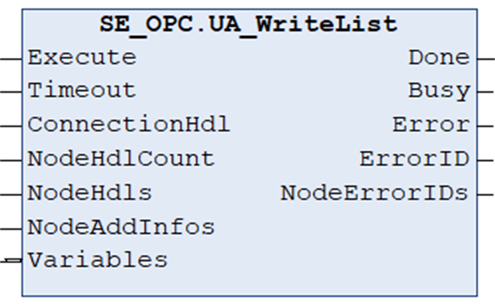
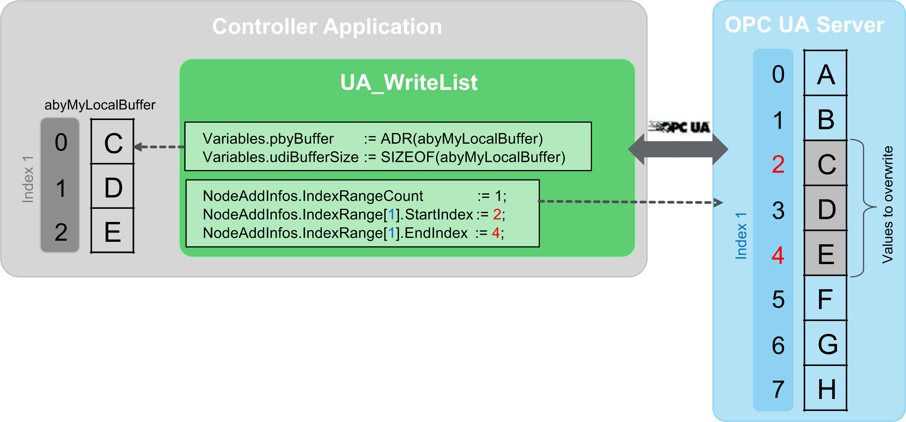

# UA\_WriteList

## Overview

|  |  |
| --- | --- |
| Type: | Function block |
| Available as of: | V1.0.0.0 |

## Functional Description

The function block UA\_WriteList is used to write values of multiple nodes using a list of node handles.

NOTE: To help avoid an inconsistent response, do not modify parameters while the function block is executing (Busy = TRUE).

| WARNING | |
| --- | --- |
|  | UNINTENDED EQUIPMENT OPERATION  Do not modify input parameters while the Busy output is equal to TRUE.  Failure to follow these instructions can result in death, serious injury, or equipment damage. |

NOTE: ByteString is represented as a one-dimensional ARRAY OF BYTE on the client side. If ByteString is declared on the server side, use a buffer of type ARRAY OF BYTE and NodeDataType UATypeByte.

NOTE: The function block does not support the MaxAge feature specified by the OPC UA protocol.

## Interface

| Input | Data type | Description |
| --- | --- | --- |
| Execute | BOOL | Upon a rising edge, the function block is being executed.  Also refer to [*Behavior of Function Blocks with the Input Execute*](D-SE-0100307.html#D-SE-0100307__D-SE-0100307.7). |
| Timeout | TIME | Maximum time to respond.  Value range: 2 s...60 s  If the value is out of range the upper or lower limit is applied.  Default value: GPL.Timeout |
| ConnectionHdl | DWORD | Connection handle. |
| NodeHdlCount | UINT | Number of node handles in the NodeHdls array.  Value range: 1..GPL.MAX\_ELEMENTS\_NODELIST] |
| NodeHdls | ARRAY [1..GPL.MAX\_ELEMENTS\_NODELIST] OF DWORD | Array containing node handles. |
| NodeAddInfos | ARRAY [1..GPL.MAX\_ELEMENTS\_NODELIST] OF [UANodeAdditionalInfo](D-SE-0099968.html#D-SE-0099968__D-SE-0099968.2) | Array containing additional node information like attribute and index range. |

| Input/Output | Data type | Description |
| --- | --- | --- |
| Variables | ARRAY [1..GPL.MAX\_ELEMENTS\_NODELIST] OF [ST\_Variable](D-SE-0099975.html#D-SE-0099975__D-SE-0099975.2) | Array containing information about the variables to read and the corresponding memory areas.  NOTE: Do not process the variables until the function block indicates Done. |

| Output | Data type | Description |
| --- | --- | --- |
| Done | BOOL | Indicates that the execution of the function block was completed successfully. |
| Busy | BOOL | Indicates that the execution of the function block is in progress. |
| Error | BOOL | Indicates that an error was detected during execution.  NOTE: Even if Error indicates FALSE, verify the corresponding ErrorIDs before processing the namespace indexes. |
| ErrorID | [ET\_Result](D-SE-0099997.html#D-SE-0099997__D-SE-0099997.5) | Provides additional diagnostic information as a numeric value.  For each specified namespace URI, a separate result is provided. |
| NodeErrorIDs | ARRAY [1..GPL.MAX\_ELEMENTS\_ NODELIST] OF [ET\_Result](D-SE-0099997.html#D-SE-0099997__D-SE-0099997.5) | Contains an error value for each element of the NodeHdls array. |

## Example

Following example illustrates how to write elements to an array published by the OPC UA server.

The inputs Variables.pbyBuffer and Variables.udiBufferSize describe the memory allocated inside the controller application containing the elements to write.

The input NodeAddInfos describes the elements of the OPC UA server to overwrite.

EIO0000004021.06