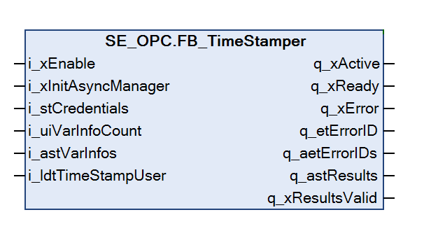

# FB\_TimeStamper

## Overview

|  |  |
| --- | --- |
| Type: | Function block |
| Available as of: | V2.1.6.0 |

## Functional Description

The function block FB\_TimeStamper is used to create a list of time-stamped variables which will be stored in the RAM for the OPC UA server. Only one function block instance is allowed at a time.

NOTE: The function block FB\_TimeStamper is not supported by PacDrive LMC controllers.

NOTE: As the variables are time-stamped according to the real-time clock (RTC) of the controller, set the RTC to the correct time. As an alternative, you can provide a user-specific timestamp at the input i\_ldtTimeStampUser.

By enabling the function block, it is verified whether the variables are available inside the symbol configuration and the timestamp is set. A maximum of 128 variables can be time-stamped.

NOTE: The function block uses an asynchronous task to verify the existence of the variables inside the symbol configuration. If the asynchronous manager is not initialized inside the application and the input i\_xInitAsyncManager is set to TRUE, the function block initializes the asynchronous manager. This process increases the execution time of the function block for one cycle. Consider this in the watchdog configuration of the calling task.

NOTE: Do not modify the variable information at the input of the function block while the function block is active. To update the variables that will be time-stamped, you must disable and re-enable the function block.

The cycle time of the task calling the function block corresponds to the sample rate to detect value changes of the variables to time stamp. With each function block call, the values of the variables referenced by the pointer inside the input structure i\_astVarInfos are compared with the respective values at the previous function block call. Only value changes slower than the interval between two function block calls can be detected. If a value change has been detected, the output q\_astResults is updated with the new values and the new timestamp. Process the values provided by q\_astResults only if the respective variables inside q\_aetErrorIDs indicate no error and q\_xResultsValid is TRUE.

NOTE: The output q\_astResults can be updated with every function block call. Consider this if you access q\_astResults from another task.

The function block FB\_TimeStamper must be available on the same controller as the OPC UA server. The OPC UA server gets the reference to the function block output q\_astResults when the function block is enabled and with every online change of the application. If the function block is enabled, the OPC UA server accesses the output q\_astResults to retrieve, for example, the source timestamp of a variable for the OPC UA client.

NOTE: While the OPC UA server accesses the output q\_astResults, the comparison of the values of the variables to time stamp inside the function block is skipped and the data of q\_astResults is not updated.

## Interface

| Input | Data type | Description |
| --- | --- | --- |
| i\_xEnable | BOOL | Activation and initialization of the function block. |
| i\_xInitAsyncManager | BOOL | If TRUE, the asynchronous manager is initialized by the function block during the first initialization (if not yet done).  If FALSE, an error message is returned in case the asynchronous manager has not been initialized. |
| i\_stCredentials | ST\_Credentials | Credentials to access variables of the symbol configuration if symbol sets are enabled. |
| i\_uiVarInfoCount | UINT | Number of variables to time stamp.  Value range: 1...128 |
| i\_astVarInfos | ARRAY [1..GPL.Gc\_uiMaxVariablestimeStamper] OF ST\_VarInfo | Structure containing information of variables to time stamp. |
| i\_ldtTimeStampUser | LDATE\_AND\_TIME | User-specific time stamp.  If this value is not assigned, the RTC of the controller is used. |

| Output | Data type | Description |
| --- | --- | --- |
| q\_xActive | BOOL | If the function block is active, the output is set to TRUE. |
| q\_xReady | BOOL | If the initialization is successful, the output is set to TRUE as long as the function block is operating. |
| q\_xError | BOOL | If this output is set to TRUE, an error has been detected. |
| q\_etErrorID | ET\_Result | Provides diagnostic and status information. |
| q\_aetErrorIDs | ARRAY [1..GPL.Gc\_uiMaxVariablesTimeStamper] OF ET\_Result | Provides diagnostic and status information for each monitored variable. |
| q\_astResults | ARRAY [1..GPL.Gc\_uiMaxVariablesTimeStamper] OF ST\_TimeStampResults | Structure containing information about monitored variables including the timestamp. |
| q\_xResultsValid | BOOL | Indicates if value-timestamp pairs available at the output q\_astResults are valid and can be processed.  Verify this output before you access q\_astResults from another task. |

EIO0000004021.06