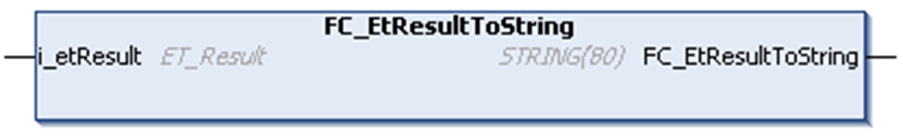

# FC\_•••ToString

## Overview

Example of one of the functions that convert an enumeration, in this case EtResult, to a string variable. To convert other enumerations, use the name of the enumeration as part of the function name preceded by FC\_.

## Task

Converts a variable of the corresponding [enumeration type](Enumerations-4D034CEB.html) to a variable of type STRING.

## Interface

| Input | Data type | Description |
| --- | --- | --- |
| i\_etResult | Corresponding enumeration of this library. | Enumeration to be converted. |

## Return Value

| Data type | Description |
| --- | --- |
| STRING(80) | Provides the corresponding text. |

EIO0000004021.06